# Day03-04 Runtime Architecture Blueprint

> 本文是《mini-agent-runtime》书籍中的 Runtime Blueprint。
>
> 它不是新的学习章节，也不是新的学习笔记，而是对 Day03-01、Day03-02、Day03-03 已讨论内容的架构整理。
>
> 本文只做抽象、归纳和结构化表达，不引入新的 Agent Framework，不扩展未讨论过的新概念。

---

## 目录

1. Runtime Overall Architecture
2. Component Dependency Graph
3. Ownership Graph
4. Conversation Lifecycle
5. Message Flow
6. Agent Loop Sequence Diagram
7. Tool Call Sequence
8. Internal Message → Provider Adapter
9. Runtime Data Model
10. Architecture Principles

---

## 第一部分：Runtime Overall Architecture

Runtime 的总体定位是：

```text
Runtime = Orchestrator
```

Runtime 不负责把所有能力写进自己内部，而是协调 Conversation、ContextBuilder、ToolManager、MemoryManager、LLM Provider、Adapter Layer 等模块完成 Agent Loop。

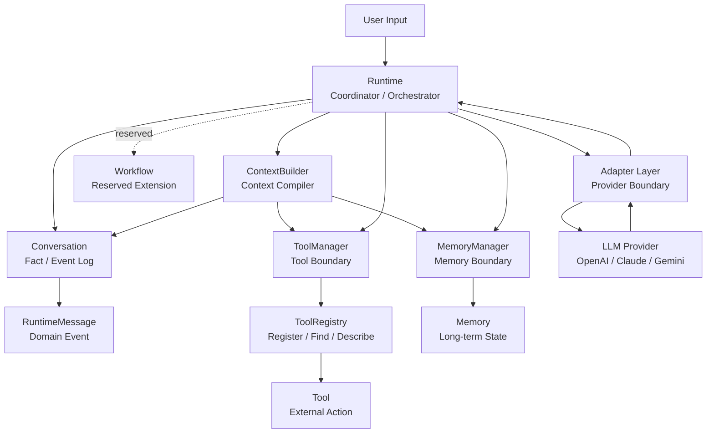

### 模块职责

| 模块 | 职责 |
|---|---|
| Runtime | 控制 Agent Loop，协调组件，决定流程继续、暂停或结束。 |
| Conversation | 保存真实发生过的历史事实，更接近 Event Log。 |
| RuntimeMessage | 表达一条 Runtime 事实事件，是 Conversation 的最小记录单位。 |
| ContextBuilder | 从 Conversation、Summary、Memory、Tool Schema 等状态编译当前 LLM Context。 |
| ToolManager | 工具能力边界，负责组织工具相关能力。 |
| ToolRegistry | 注册、查找、描述 Tool，避免工具查找逻辑散落在 Runtime。 |
| MemoryManager | 管理 Memory 能力，作为后续可组合模块接入 Runtime。 |
| Workflow | 预留扩展位，用于后续阶段性流程与状态变化。 |
| LLM Provider | 具体模型供应商。Runtime 不直接依赖其 SDK 格式。 |
| Adapter Layer | 在 Runtime 内部模型与 Provider 外部格式之间做转换。 |

核心关系可以压缩成一句话：

```text
Runtime controls the loop.
Conversation stores the facts.
ContextBuilder builds the view.
ToolManager manages tools.
MemoryManager manages memory.
Adapter Layer isolates providers.
```

---

## 第二部分：Component Dependency Graph

Day03 的依赖方向原则是：

```text
底层对象不依赖上层对象。
组件不反向依赖 Runtime。
```

### 核心依赖方向

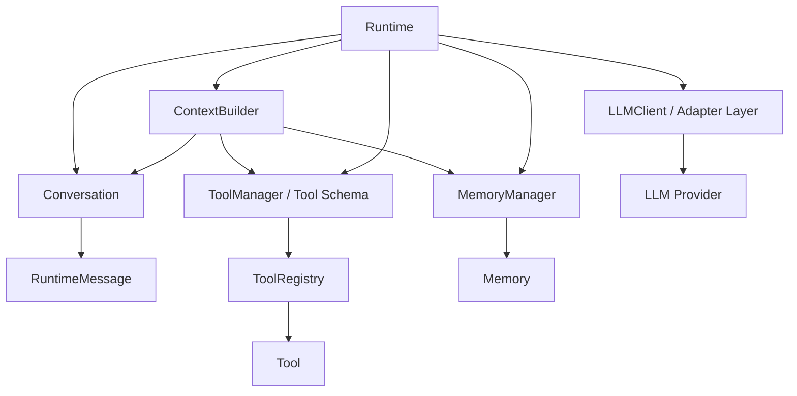

最重要的主线是：

```text
Runtime
  |
  v
Conversation
  |
  v
RuntimeMessage
```

这表示：

- Runtime 可以依赖 Conversation；
- Conversation 可以拥有 RuntimeMessage；
- RuntimeMessage 不应该知道 Runtime；
- Conversation 不应该知道 Runtime、ContextBuilder、LLM Provider；
- Tool 不应该反向依赖 Runtime；
- LLMClient / Adapter 不应该修改 Conversation。

### 禁止的反向依赖

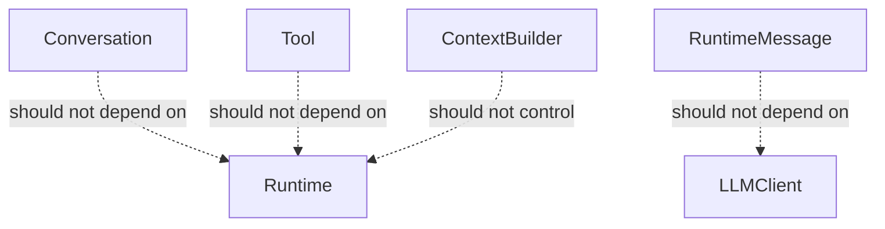

依赖方向不是图形美观问题，而是边界问题：

```text
Runtime 依赖组件，组件不反向依赖 Runtime。
```

---

## 第三部分：Ownership Graph

Ownership 用来回答：

```text
谁拥有谁？
谁可以修改谁？
谁只是读取谁？
```

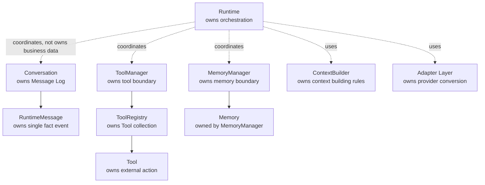

### Ownership 结论

| 对象 | Ownership |
|---|---|
| Runtime | 拥有流程编排权，不拥有业务对象。 |
| Conversation | 拥有 Message 历史。 |
| RuntimeMessage | 拥有单个事实事件的表达。 |
| ContextBuilder | 拥有上下文构建规则。 |
| ToolManager | 拥有工具能力边界。 |
| ToolRegistry | 拥有 Tool 集合。 |
| Tool | 拥有外部动作的执行逻辑。 |
| MemoryManager | 拥有 Memory 能力边界。 |
| Memory | 属于 MemoryManager 管理。 |
| Adapter Layer | 拥有 Internal Model 到 Provider Model 的转换。 |

一句话总结：

```text
Runtime 负责组织，而不是拥有。
```

---

## 第四部分：Conversation Lifecycle

Conversation 的本质不是普通聊天数组，而是 Runtime 的事实账本。

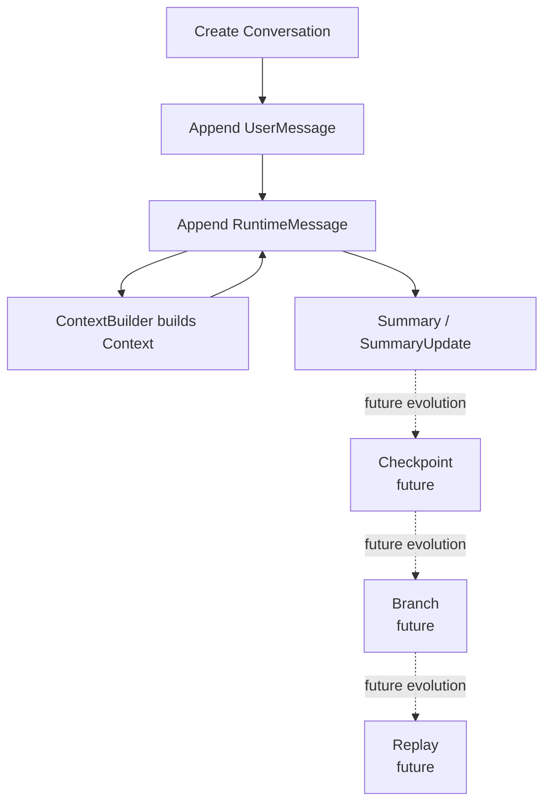

### 生命周期说明

| 阶段 | 说明 |
|---|---|
| 创建 | Runtime 创建或接入一个 Conversation。 |
| 追加 Message | Runtime 观察到真实事件后，请求 Conversation 追加 RuntimeMessage。 |
| 构建 Context | ContextBuilder 读取 Conversation，并构建当前 LLM 调用需要的 Context。 |
| Summary | Summary 是 Cache / Projection，不是 Conversation 对 LLM 的直接依赖。 |
| Checkpoint | 未来用于长任务恢复。 |
| Branch | 未来用于多路径探索。 |
| Replay | 未来用于调试、复现和恢复。 |

Conversation 的边界：

```text
Conversation 只负责拥有消息，而不是处理消息。
```

它不负责：

- 调用 LLM；
- 执行 Tool；
- 生成 Summary；
- 写入 Memory；
- 调度 Workflow；
- 决定 Agent Loop；
- 拼接 Provider Prompt。

---

## 第五部分：Message Flow

Message 是 Runtime 运行过程中发生过的事实事件。

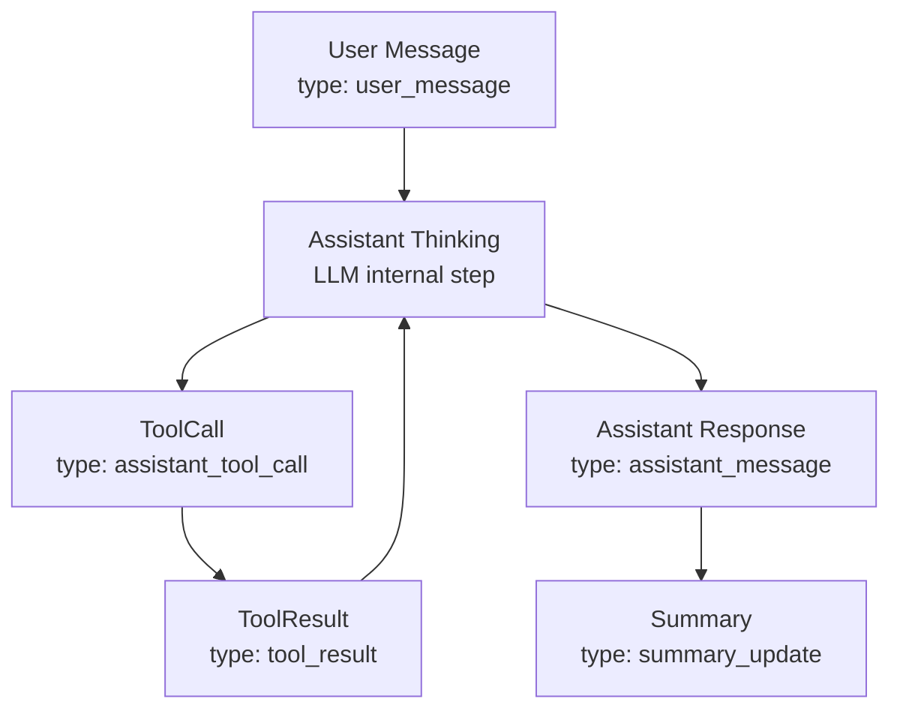

Conversation 中记录的不是固定模板，而是真实发生的事件。

### 纯聊天场景

```text
UserMessage
AssistantMessage
```

### Tool Call 场景

```text
UserMessage
AssistantToolCallMessage
ToolResultMessage
AssistantMessage
```

### Human Approval 场景

```text
UserMessage
ApprovalRequestMessage
ApprovalResultMessage
ToolResultMessage
AssistantMessage
```

### RuntimeMessage 的变化过程

```text
Created
  |
  v
Appended
  |
  v
Persisted
  |
  v
Projected
  |
  v
Used by ContextBuilder
```

关键结论：

```text
发生几件值得记录的事，Conversation 就记录几件事。
```

---

## 第六部分：Agent Loop Sequence Diagram

Runtime 是真正控制循环的对象。

LLM 不会自己循环，Tool 不会自己循环，Conversation 不会自己循环，ContextBuilder 也不会自己循环。

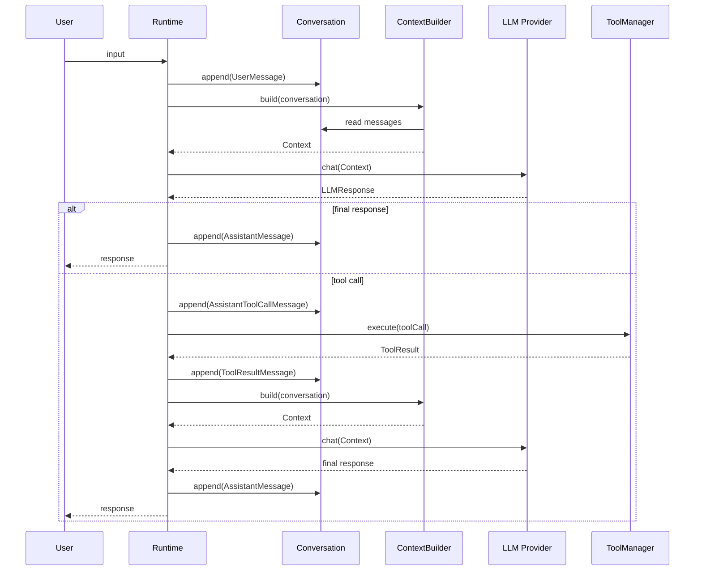

Agent Loop 的核心步骤：

```text
User
  |
  v
Runtime
  |
  v
ContextBuilder
  |
  v
LLM
  |
  v
ToolManager
  |
  v
LLM
  |
  v
Conversation
  |
  v
Response
```

边界规则：

```text
Runtime decides When.
Components decide How.
```

---

## 第七部分：Tool Call Sequence

LLM 返回 ToolCall 不代表工具已经执行。

它只是请求调用。

真正执行的是 Runtime 协调 ToolManager / ToolRegistry / Tool 完成。

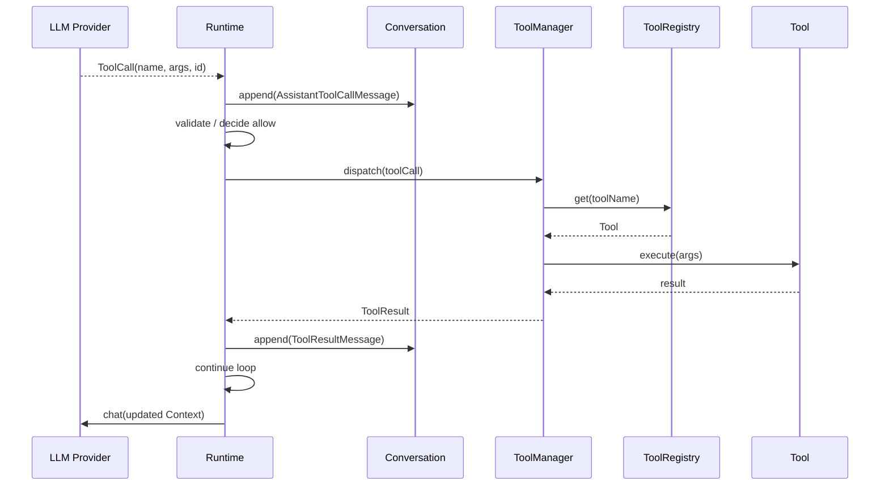

Tool Call 的职责边界：

```text
LLM     = 提出 ToolCall 建议
Runtime = 判断是否允许并控制流程
Tool    = 执行真实外部动作
```

这条边界是 Human Approval、权限控制、Tool Timeout、Retry、审计日志成立的基础。

---

## 第八部分：Internal Message → Provider Adapter

Day03 的关键判断是：

```text
Runtime 永远不要直接使用 OpenAI Message、Claude Message 或任何第三方 SDK Message 作为自己的核心数据模型。
```

Internal Model 由业务决定。

Provider Model 由供应商决定。

二者之间必须有 Adapter。

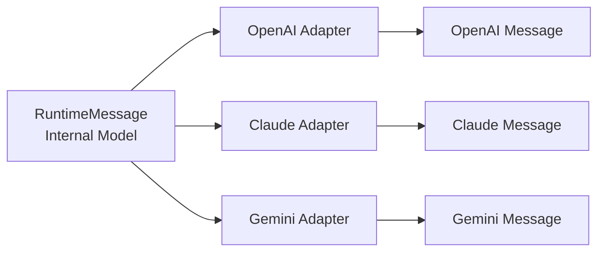

Provider Adapter 的位置：

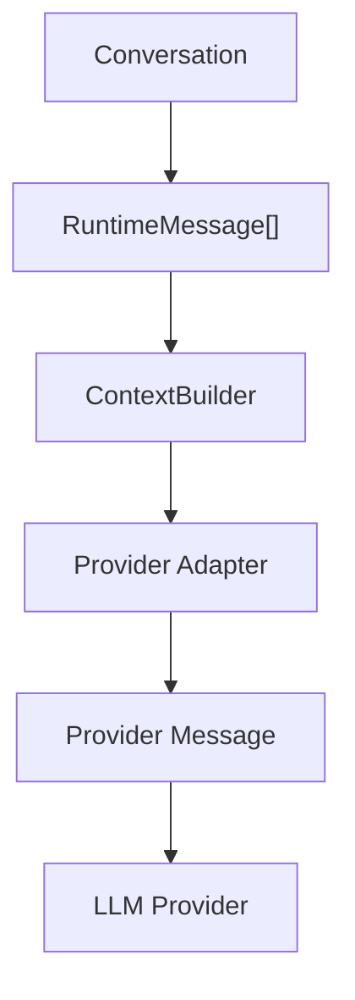

Adapter 规则：

```text
RuntimeMessage
  |
  v
Provider Adapter
  |
  v
Provider Message
```

Runtime 内部不应该被供应商格式污染。

---

## 第九部分：Runtime Data Model

本节只保留 Day03 最终版本的数据模型。

### Conversation

```ts
interface Conversation {
  id: string
  title?: string
  metadata: ConversationMetadata
  messages: RuntimeMessage[]
}
```

Conversation 拥有 Message。

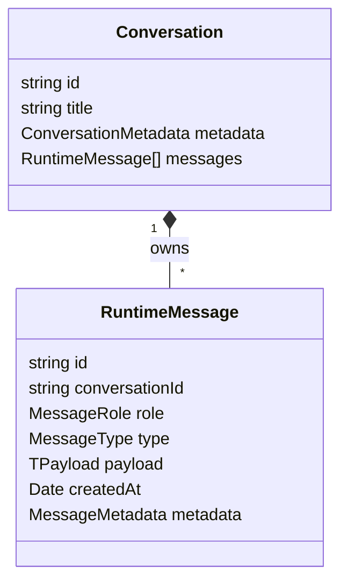

### RuntimeMessage

```ts
interface RuntimeMessage<TPayload = unknown> {
  id: string
  conversationId: string
  role: MessageRole
  type: MessageType
  payload: TPayload
  createdAt: Date
  metadata?: MessageMetadata
}
```

`role` 表达谁产生消息。

`type` 表达发生了什么事件。

```ts
type MessageRole =
  | "system"
  | "user"
  | "assistant"
  | "tool"
  | "runtime"
  | "human"

type MessageType =
  | "user_message"
  | "assistant_message"
  | "assistant_tool_call"
  | "tool_result"
  | "tool_error"
  | "approval_request"
  | "approval_result"
  | "summary_update"
  | "memory_write"
  | "checkpoint"
```

### Payload

不同 MessageType 对应不同 Payload。

```ts
interface UserMessagePayload {
  content: string
}

interface AssistantMessagePayload {
  content: string
}

interface ToolCallPayload {
  toolCallId: string
  toolName: string
  arguments: Record<string, unknown>
}

interface ToolResultPayload {
  toolCallId: string
  toolName: string
  result: unknown
}

interface ToolErrorPayload {
  toolCallId: string
  toolName: string
  error: {
    message: string
    code?: string
  }
}
```

### Metadata

```ts
interface ConversationMetadata {
  createdAt: Date
  updatedAt: Date
  summary?: string
  tags?: string[]
}

type MessageMetadata = Record<string, unknown>
```

### Relationship

Runtime 数据模型中的关系保持克制：

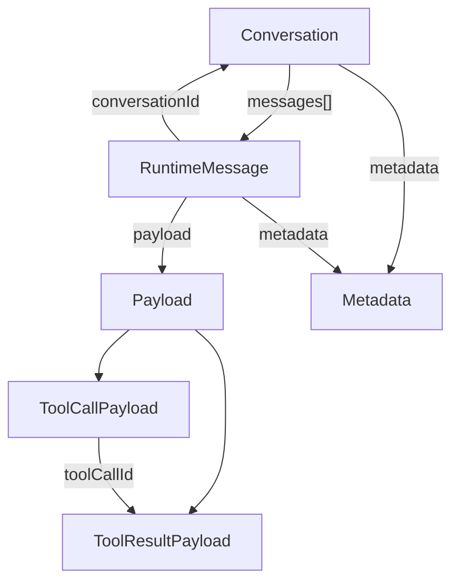

关键关系：

| Relationship | 含义 |
|---|---|
| Conversation → RuntimeMessage[] | Conversation 拥有消息历史。 |
| RuntimeMessage.conversationId → Conversation | Message 属于某个 Conversation。 |
| RuntimeMessage.payload → Payload | Message 的具体事件数据由 Payload 表达。 |
| RuntimeMessage.metadata → MessageMetadata | Message 可以携带开放元数据。 |
| ToolCallPayload.toolCallId → ToolResultPayload.toolCallId | ToolResult 回应某次 ToolCall。 |

Provider Adapter：

```ts
interface MessageAdapter<TProviderMessage> {
  toProviderMessages(messages: RuntimeMessage[]): TProviderMessage[]
}
```

最终结构：

```text
Conversation
  |
  v
RuntimeMessage[]
  |
  v
ContextBuilder
  |
  v
Provider Adapter
  |
  v
OpenAI / Claude / Gemini
```

---

## 第十部分：Architecture Principles

### 1. Domain First，Runtime Last

先设计 Runtime 世界里的领域对象，再让 Runtime 去协调它们。

### 2. Runtime 是 Coordinator

Runtime 负责控制 Agent Loop，不负责把 LLM、Tool、Context、Memory、Summary 全部实现到自己内部。

### 3. Ownership

先问谁拥有谁、谁修改谁、谁只是读取谁，再决定对象边界。

### 4. Boundary

Conversation 保存事实，ContextBuilder 构建视图，Summary 是 Cache，Provider Adapter 处理外部格式。

### 5. Dependency Direction

依赖方向应该从 Runtime 指向组件，从 Conversation 指向 Message，而不是让底层对象反向依赖上层流程。

### 6. Adapter Pattern

Runtime 内部模型不直接等于 Provider Message，供应商格式必须通过 Adapter 转换。

### 7. Internal Model

RuntimeMessage 是 Runtime 的内部领域模型，不应该被 OpenAI、Claude、Gemini 等 SDK 格式绑定。

### 8. Every Module Can Run Alone

Conversation、ToolRegistry、ContextBuilder 等模块应当离开 Runtime 也能独立测试。

### 9. Runtime 负责组织，而不是拥有

Runtime 拥有编排权，不拥有 Conversation 的消息、ToolRegistry 的工具集合或 MemoryManager 的记忆状态。

### 10. Runtime Decides When，Components Decide How

Runtime 决定什么时候追加消息、构建上下文、调用模型、执行工具；组件决定自己如何完成职责。

### 11. Controlled Side Effects

副作用不应该全部塞给 Tool，而应该放在拥有该职责的对象内部。

### 12. Message Append-only

Message 一旦追加到 Conversation，应尽量不可变；需要修正时优先追加新事件。

### 13. Conversation = Fact，Context = View，Summary = Cache

Conversation 保存真实历史，Context 是当前调用视图，Summary 是上下文压缩缓存。

### 14. Composition over Inheritance

Runtime 能力通过组合接入，而不是通过继承堆叠成越来越大的 Runtime 类。

---

## Blueprint 总结

Day03 的 Runtime 架构可以收束为一张图：

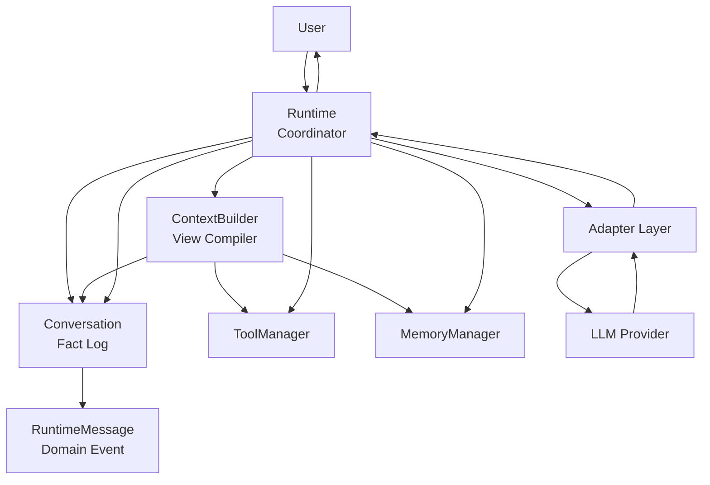

最终判断：

```text
写 Agent Runtime，不是把 Agent 能力堆进 Runtime，
而是不断寻找正确的职责边界。
```

