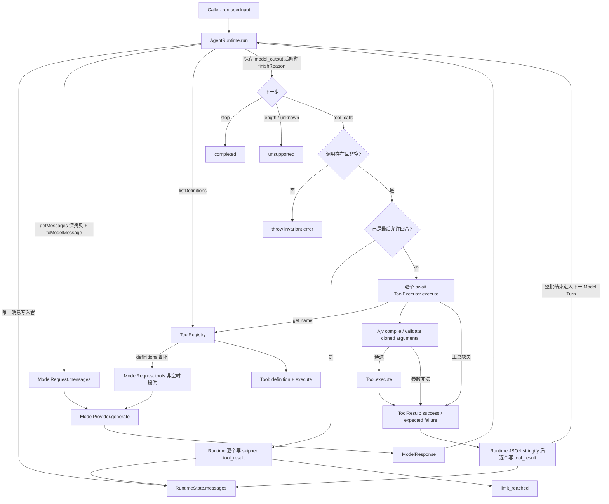

# Day08 / Part VII-C：Tool Registry + Tool Executor + Error Contract

> Engineering Learning Log + Architecture Record
> Milestone 状态：Done
> 归档与代码复核日期：2026-09-10
> 代码基线：`41327a8`，包含 `d62078d` 主体实现和 `41327a8` 终止边界修复；归档开始时工作区干净。本次归档只修改 Markdown。

本文由三组证据交叉核对：

1. 当前仓库 `src/`、`test/`、工程配置与上述两个提交，决定“最终实际实现了什么”。
2. [完整 ChatGPT 讨论入口](https://chatgpt.com/g/g-p-6a62c8cc44e88191bb384ccd56dca50c/c/6a9a7287-0380-83e8-aa16-d99cdc86b75e)。通过任务读取接口分页取得全部 16 轮可读取的用户／助手文本，归档为[架构讨论与 Implementation Task](source/day08-part-vii-c-architecture-chatgpt-source.md)和[交付、Review 与 Closure](source/day08-part-vii-c-review-chatgpt-source.md)。附件 ZIP 正文未由接口提供，历史压缩包问题按 Review 陈述记录，不冒充本次附件核验。
3. [Codex 实现、测试与 Debug 证据](source/day08-part-vii-c-codex-implementation-source.md)：本任务实际过程、终止边界 Fix，以及归档时重新运行的验证。

“最终采用”以修复后的源码为准；“初版／候选”保留推导过程，不作为当前 API。讨论中的天气例子只是说明，当前新增 Demo 使用 add 和确定性 Provider，没有调用真实 LLM。

## 1. Milestone Goal

VII-B 能保存模型提出的 Tool Call，却只能返回 unsupported。VII-C 要让 Runtime 自己把这个行动请求变成一次执行，再把执行情况交回模型：

```text
一次 AgentRuntime.run(userInput)
  → Model Turn #1
  → model_output(tool_calls)
  → 工具查找、参数校验、执行
  → tool_result
  → Model Turn #2
  → model_output(final answer)
  → completed
```

完成标准不只是“函数能相加”。必须证明同一次 run 内发生第二次 generate，第二次请求中确实包含工具结果；失败也能回流；多个调用不会漏掉；模型一直请求工具时能够正常终止。

最终还补充了一个初版遗漏的完成条件：达到上限并正常返回后，最后一批工具调用仍有对应结果，后续 run 可以在这些结果之后追加新用户输入。

## 2. Starting Point

起点是已完成的 [VII-A](day08-part-vii-a-foundation-model-provider.md) 与 [VII-B](day08-part-vii-b-runtime-state-agent-loop.md)，不是重新设计 Runtime。

| 已有能力／约束 | VII-C 的承接方式 |
| --- | --- |
| `ToolDefinition` 描述 name、description、parameters | 原样保留，只给模型描述工具 |
| `ToolCall.arguments: unknown` | 原样保留，在 Executor 内建立校验边界 |
| Provider Adapter 解析 JSON | 不让 Provider 校验具体工具 Schema 或执行工具 |
| `RuntimeToolMessage { type, toolCallId, content }` | 使用既有字符串 content 保存 JSON 结果 |
| `RuntimeState { messages }` | 不增加 errors、iteration、status 或 tools |
| AgentRuntime 拥有 State | 循环继续内置于 run，无独立 AgentLoop class |
| `getMessages()` 深拷贝；请求／响应引用隔离 | 新增工具参数、结果与定义的引用边界后继续验证 |
| `stop → completed`；其余原因 → unsupported | 仅将 tool_calls 改为内部继续，并新增 Runtime 上限 outcome |
| Provider throw／rejection 原样传播 | 保持不变 |
| 8 项 Provider 映射测试、9 项 Runtime 测试 | 保留覆盖；更新旧 tool_calls 测试的行为语义 |

VII-B 留下的 B-P1 是“工具调用不能靠 caller 新开 run 接续”；B-P3 是“unknown 怎样进入具体参数契约”。两者是本轮的直接任务。B-P2“Provider 失败后重试当前步骤与新增 run 的区别”继续延期。

## 3. Architecture Questions

完整讨论先列出责任问题，再按 C-1～C-6 逐步收敛，没有先按类名搭框架。

| 推导阶段 | 真实矛盾 | 收敛结果 |
| --- | --- | --- |
| C-1 Tool Contract | 已有 ToolDefinition，为什么仍不能执行？ | 描述协议与 executable Tool 分离 |
| C-2 Registry | 模型只返回名字；模型看到的工具与可执行工具会不会不一致？ | 同一个 Registry 提供查找和 definitions；禁止重名 |
| C-3 Arguments | JSON.parse 成功，为何参数仍可能错误？ | unknown 先按工具声明的 Schema 校验，失败不进入 execute |
| C-4 Executor / Error | 工具找不到或参数错，是否要让整个 run 崩溃？ | 预期调用失败回流；Provider 与内部实现异常继续抛出 |
| C-5 Loop | 执行结果由谁交回模型？ | Runtime 在同一次 run 内推进，caller 不接管中间步骤 |
| C-6 Boundary | 真正能继续之后，什么防止无限调用？ | 限制 Model Turn；配置与局部计数不进入 State |
| Review 追加问题 | 最后一轮不执行工具就返回，会留下什么历史？ | 每个调用写 skipped 结果，再返回 limit_reached |

最后一个问题不是一开始就讨论完整的。它是在初版实现和测试都成立之后，由跨 run 使用场景暴露出来的。

## 4. Design Decisions

### 最终采用

- 新增 `Tool<TArgs>`，包含既有 ToolDefinition 和同步／异步 execute。返回值使用最小递归 `ToolValue` 描述 JSON 兼容结果。
- ToolRegistry 内部使用 Map，公开 `register / get / listDefinitions`。重复注册抛普通 Error，缺失查找返回 undefined，definitions 保持注册顺序。
- Registry 是工具唯一来源；每次 ModelRequest 的 tools 都由它生成，空 Registry 时省略 tools。
- ToolExecutor 接收一个 ToolCall，完成查找、Schema 编译／校验、execute 与结果规范化。只在 execute 调用周围 catch。
- Ajv 使用既有 parameters；严格模式、同步校验，不启用类型转换、默认值插入或额外字段删除。
- 成功、预期失败和预算跳过都使用 ToolResult，再写入既有 RuntimeToolMessage.content。
- AgentRuntime 顺序执行整批调用，每个结果立即写入 State，然后进入下一次模型调用。
- maxTurns 默认 5，要求正安全整数；currentTurn 从 1 开始，是单次 run 的局部变量。
- `limit_reached` 属于 RunOutcome，不能加入模型 FinishReason。
- 最后一轮的合法 tool_calls 不交给 Executor，Runtime 直接为每个调用生成 skipped 结果；缺失或空 toolCalls 在预算判断前抛 invariant error。

当前结果契约原文：

```ts
export interface ToolError {
  code: "TOOL_NOT_FOUND" | "INVALID_ARGUMENTS" | "TOOL_EXECUTION_FAILED" | "TOOL_EXECUTION_SKIPPED";
  message: string;
}

export type ToolResult =
  | { success: true; result: ToolValue }
  | { success: false; error: ToolError };
```

### 讨论过但没有采用／已经被修正

| 方案 | 最终取舍 |
| --- | --- |
| 直接给 ToolDefinition 增加 execute | 没采用；避免模型协议混入执行代码 |
| 后注册工具覆盖同名工具 | 没采用；没有版本或覆盖规则就直接失败 |
| caller 分别维护工具和模型 definitions | 没采用；避免能力清单不一致 |
| 每个 Tool 手写通用参数判断 | 没采用；校验统一放在 Executor |
| 自研 validator，或 Zod 再转 JSON Schema | 没采用；当前 parameters 已是 JSON Schema，直接使用 Ajv |
| 将所有 arguments 改成强制对象或全面 JSONValue 类型 | 没采用；模型输入继续 unknown，ToolValue 只约束执行返回值 |
| 所有工具错误都 throw，或整个 Executor catch-all | 均没采用；前者阻断回流，后者隐藏 Runtime Bug |
| Tool 主动调用模型，或 caller 新开 run 继续 | 没采用；RunOutcome 只表达整个 run 的结束 |
| 限制 Tool Call 数量、模糊的 maxIterations、默认无限 | 没采用；明确限制 generate 次数，默认 5 |
| 上限抛错，或把 max_turns 塞进 FinishReason | 没采用；使用 Runtime-level limit_reached |
| 最后一轮先执行工具再结束 | 没采用；没有下一模型回合消费结果，不执行该批工具 |
| 最后一轮仅保存调用便直接 return | 初版采用，Review 后修正为写齐 skipped 结果再 return |
| Schema 自动推导 TArgs、结构化改造整个消息层 | Review 认为当前不必实现；保留现有边界 |

讨论中的 while 是算法示意；最终代码使用 for。早期 `AgentRuntime({ provider, tools, maxTurns })` 也只是概念示例，实际 API 保留 provider 为第一个参数。

## 5. Why These Decisions

### 描述、查找和执行为什么分开

ToolDefinition 是发给模型的说明，execute 是本地代码，两者服务不同边界。新增 Tool 将它们组合，而不是污染旧类型。Registry 只回答有哪些工具、名字对应谁；Executor 才回答本次调用是否合法、如何运行。这样新增 add 不需要改 AgentRuntime 的业务判断。

Registry 用 class 是因为它有“维护集合且禁止重名”的行为；State 继续用 interface 是因为它只承载数据。这是按职责选择形态，不要求所有模块统一面向对象。

### “一份 Schema”不等于“编译器证明了所有类型”

模型描述和运行时校验使用同一份参数规则，避免两套校验逻辑漂移。Registry 对定义做深拷贝，Executor 缓存该工具的校验函数，Provider 拿到的也是副本。

但实际类型是 `definition: ToolDefinition`，parameters 仍为 `Record<string, unknown>`。Registry 为容纳不同 TArgs，包装执行函数时有 `args as TArgs`。它不是运行时验证，更不能证明 Schema 与 TArgs 一致。

最终承诺必须精确表述：**Executor 保证符合 Schema 后才调用工具；Tool 作者负责 Schema 确实描述 TArgs。** 本轮没有类型生成或 Schema 泛型推导。

### 为什么错误需要 code 和 message

code 为测试和消费者提供稳定分类；message 提供说明。它们不要求构建错误继承框架。Tool 不存在、参数错、execute 抛错都能成为模型下一步所需的信息，而不是立即结束整个 run。

“可预期”按调用边界识别，不按异常类名猜测根因。发生在 Tool.execute 内的普通 TypeError 也会被规范化；Executor 自身查找、编译、验证或 Runtime 序列化阶段的异常继续传播。代码没有能力判断业务函数内部到底是网络错误还是程序员失误。

### 为什么 currentTurn 与 maxTurns 不属于 State

下一模型回合需要知道刚才执行了什么，而不需要将本次局部计数当成历史消息。maxTurns 是 Runtime 配置，currentTurn 是执行算法的局部变量。循环增加了执行能力，却没有迫使 messages-only State 改型。

### 为什么 skipped 必须由 Runtime 产生

预算决定发生在 Runtime，Executor 只执行一次已经交给它的调用。最终回合尚未进入查找、校验或执行阶段，Runtime 直接记录“因 maxTurns 未执行”，不会伪造业务成功，也不必先查工具是否存在。

`TOOL_EXECUTION_SKIPPED` 表示一次调用的处置事实；`limit_reached` 表示整个 run 的终止原因。它们服务不同层次，同时存在不算重复。

## 6. Implementation Scope

实际公开使用方式：

```ts
const registry = new ToolRegistry();
registry.register(addTool);
const runtime = new AgentRuntime(provider, { registry, maxTurns: 5 });
const outcome = await runtime.run("2 + 3?");
const history = runtime.getMessages();
```

`new AgentRuntime(provider)` 仍合法，内部创建空 Registry。Runtime 自己创建 ToolExecutor，未增加 Executor 注入框架。

| 层 | 当前责任 |
| --- | --- |
| Provider / Adapter | 协议转换、JSON 参数解析、模型调用 |
| ToolRegistry | 注册、查找、definitions 副本 |
| ToolExecutor | 单次调用的确定性执行边界 |
| Tool.execute | 具体能力，返回 ToolValue 或 Promise |
| AgentRuntime | State 写入、模型请求、批次顺序、预算、skipped、RunOutcome |
| RuntimeState | messages |

正常执行失败继续循环不等于实现 Retry Policy：下一步由模型返回的新响应决定，Runtime 没有自动重试原调用。maxTurns 限制 generate 次数，不是耗时、HTTP 重试次数、Token 数或工具批次大小限制。

## 7. Code Changes

| 文件 | 本轮变化与关键细节 |
| --- | --- |
| [tools/tool.ts](../../src/tools/tool.ts) | 新增 Tool、ToolValue、ToolResult、ToolError；Fix 补 skipped 错误码 |
| [tools/tool-registry.ts](../../src/tools/tool-registry.ts) | Map 注册；definition 入库与读出深拷贝；绑定原 execute，包装泛型参数 |
| [tools/tool-executor.ts](../../src/tools/tool-executor.ts) | Ajv strict 模式；按 name 缓存 ValidateFunction；拒绝 async Schema；参数深拷贝；窄 catch |
| [runtime/agent-runtime.ts](../../src/runtime/agent-runtime.ts) | options、私有配置／依赖、for 循环、definitions、结果写回、终止修复 |
| [demo/tool-runtime-demo.ts](../../src/demo/tool-runtime-demo.ts) | 确定性 add Demo，第二次响应读取真实收到的结果 |
| [demo/runtime-demo.ts](../../src/demo/runtime-demo.ts) | 原真实 Provider Demo 遇到非 completed 即停止 |
| [test/tool-runtime.test.ts](../../test/tool-runtime.test.ts) | 初版 25 项，Fix 后 28 项工具与边界测试 |
| [test/agent-runtime.test.ts](../../test/agent-runtime.test.ts) | 更新原 unsupported(tool_calls) 为同 run 错误回流；保留 9 项覆盖 |
| [package.json](../../package.json)、[package-lock.json](../../package-lock.json) | Ajv 依赖，当前声明 `^8.20.0`；增加 demo:tools |
| [根 README](../../README.md) | 当前能力、Demo、错误与修复后的终止语义 |

原 RuntimeState、双层消息、toModelMessage、Model contract、Provider Adapter 未因 VII-C 改型。工具名保留在先前 ToolCall，结果通过 toolCallId 对应，不额外新增 RuntimeToolMessage.name 或 result 字段。

结果回流不是 Executor 直接写 State，而是：

```ts
const result = await this.#executor.execute(call);
this.#state.messages.push({
  type: "tool_result", toolCallId: call.id, content: JSON.stringify(result),
});
```

因此序列化在 Runtime，成功数据进入 State 后成为字符串，工具持有的原返回对象不能再修改该事实。Executor 对 arguments 的拷贝则防止工具反向修改已保存的 model_output。

Git 中还包含 source-review.zip 的交付物更新；这不属于 Runtime 功能或本次归档生成物。主笔记以源码为依据，不把压缩包状态当成实现 API。

## 8. Runtime Verification

### 验证演进

| 阶段 | 实际证据 |
| --- | --- |
| VII-B 基线 | 17 项测试 |
| VII-C 初版 | 42 项测试通过，但最初 build / 测试类型检查发现 Ajv 类型错误 |
| 类型修复后 | 42 项测试、build、额外测试类型检查和 Demo 通过；随后按用户要求复测仍通过 |
| lifecycle Fix | 原有边界断言更新，新增跨 run 及末轮 missing／empty 测试，总计 45 项通过 |
| 本次归档复验 | npm test、npm run build、额外测试类型检查、demo:tools 全部退出码 0 |

归档时 `npm test` 的真实末尾输出：

```text
1..45
# tests 45
# suites 0
# pass 45
# fail 0
# cancelled 0
# skipped 0
# todo 0
# duration_ms 408.29625
```

构建真实输出：

```text
> mini-agent-runtime@0.1.0 build
> tsc -p tsconfig.json
```

额外类型检查无输出，退出码 0：

```bash
./node_modules/.bin/tsc --noEmit --target ES2022 \
  --module NodeNext --moduleResolution NodeNext \
  --allowImportingTsExtensions --strict --noUncheckedIndexedAccess \
  --exactOptionalPropertyTypes --skipLibCheck \
  test/*.test.ts test/support/*.ts
```

### 测试真正锁定了什么

| 行为 | 断言价值 |
| --- | --- |
| Happy Path | 两次 generate、一次 user_input、四条事实、第二请求包含结果 |
| TOOL_NOT_FOUND | 不 reject；错误对应调用 ID，下一轮模型能看到 |
| INVALID_ARGUMENTS | null、数组、字符串、类型错、缺字段、额外字段均不执行工具 |
| execute 异常 | 同步 throw、Promise rejection、非 Error throw 都转 TOOL_EXECUTION_FAILED |
| 多调用与混合结果 | A 完成才到 B；B 参数失败后 C 继续；整批写完才问模型 |
| maxTurns | 1、3、默认 5；模型次数与工具次数分离；每个 run 重新计数 |
| 末轮调用 | 每个调用对应 skipped 结果，零末轮执行；保留 assistant 调用 |
| limit 后再 run | 下一请求顺序为 user → assistant(tool_calls) → tool A → tool B → 新 user |
| 末轮 stop | 仍返回 completed，不因预算耗尽误判 |
| Provider 错误 | 首轮 throw／reject 和工具后的 Provider failure 原对象传播 |
| 所有权 | 历史、Provider 请求／响应、工具参数／结果、Schema 副本修改不污染内部事实 |
| 内部错误 | 查找 bug、非法／async Schema、循环结果序列化异常不伪装成工具失败 |
| malformed tool_calls | 空列表／缺失即使在最后回合也抛 invariant error |

当前 45 项分为 8 项映射、9 项基础 Runtime、28 项 Tool Runtime 测试。没有真实 LLM 参数选择测试，也没有“真实模型看到错误后一定成功自我修正”的保证。

### Demo 的真实输出与证据范围

执行 `npm run demo:tools`：

```text
> mini-agent-runtime@0.1.0 demo:tools
> tsx src/demo/tool-runtime-demo.ts

Provider: deterministic demo (no external LLM)
User: 2 + 3?
Model turn 1: add {"a":2,"b":3}
Tool execute: add(2, 3) = 5
Model turn 2 received tool_result: {"success":true,"result":5}
Final answer: 2 + 3 = 5
RunOutcome: {"type":"completed"}
Model turns: 2
History: user_input -> model_output -> tool_result -> model_output
```

以上是程序输出。人工解释是：Provider 第一回合固定发起 add，第二回合检查匹配的工具消息并从其中解析 result 生成回答；工具、Executor、State、Loop 都是真实实现。它不需要 .env、不访问网络，也不证明真实 LLM 已被端到端验证。用户询问 Demo 如何测试时，这一边界已被明确说明。

## 9. Bugs / Debugging

### 9.1 测试执行通过，类型检查却失败

首版同步 Schema 防护直接读取 `validate.$async`，执行测试没有报错，但 build 和测试类型检查都报：

```text
src/tools/tool-executor.ts(24,20): error TS2339: Property '$async' does not exist on type 'ValidateFunction<unknown>'.
```

实际修复：

```ts
if ("$async" in validate && validate.$async) {
  throw new Error("Async tool schemas are not supported.");
}
```

没有删掉 async Schema 防护，也没有通过关闭 strict 或随意 any 消除报错。修复后 build 与测试类型检查均通过。这个故障说明 tsx 能运行测试，不代表编译器检查了测试和源码的全部类型关系；tsconfig 的 build include 本来只包含 src。

### 9.2 maxTurns 正常返回，却遗留未完成的调用配对

初版严格按当时 C-AD12 实现：

```text
保存 model_output(tool_calls)
→ 最后一轮不执行工具
→ return limit_reached
```

Codex 已发现后续 run 可能带出 `assistant(tool_calls) → user` 的历史，但最初把它记为 Deferred Recovery。Review 指出：同一 Runtime 连续 run 已是 VII-B 的当前能力，这个问题由 VII-C 的正常终止分支制造，不能推给 VII-G。

因此这不是“没有按任务实现”，而是原设计本身遗漏了终止后的状态条件。42 项测试当时也只锁定“不执行末轮工具并保留模型输出”，没有锁定后续请求配对。

最终修复保留“不执行”原则，增加每个调用的 skipped 结果，再 return：

```text
model_output(tool_calls: A, B)
→ tool_result(A, TOOL_EXECUTION_SKIPPED)
→ tool_result(B, TOOL_EXECUTION_SKIPPED)
→ limit_reached
```

这不是执行工具补结果，不是伪造成功，也不是调用恢复引擎。它记录了 Runtime 已经作出的跳过决定。

### 9.3 预算判断掩盖 malformed response

初版先检查 `currentTurn === maxTurns`，再检查 toolCalls 存在且非空。于是末轮 `finishReason=tool_calls`、`toolCalls=[]` 被正常 outcome 掩盖。

修复后先校验不变量再判断预算。新增测试同时覆盖 missing 和 empty；它们都验证抛错、保存模型输出且没有制造工具结果。这是检查顺序的修复，不是新增通用响应验证框架。

### 9.4 Review 输入包版本不匹配

讨论第 13 轮 Review 报告收到 `src(3).zip`，内容仍是 VII-B，无 tools、Ajv 或 maxTurns。随后用户补充最新 `source-review.zip`，第 14 轮才进行真实 VII-C 主体 Review。

这是历史会话报告的交付版本问题；本次没有拿到那些上传附件正文，不把它写成当前代码回退或本次重新解压发现。学习点是 Review 必须核对源码、测试与配置是不是同一版本，不能只读实现总结。

### 9.5 Review 环境缺依赖与本地测试要分开

最终 Review 明确记录其隔离环境报 `tsx: not found`，没有独立复跑测试；45 pass 来自用户贴回的 Codex 输出，Review 独立核对的是源码和断言。

本次归档在本地仓库实际复验成功。二者是不同证据，不应把 Review 的源码结论改写为“ChatGPT 也运行通过”。

## 10. Code Review Findings

| 分类 | 发现 | 最终处理 |
| --- | --- | --- |
| 主体通过 | Registry 唯一来源、Schema 单一来源、窄 catch、顺序执行、messages-only、没有超范围框架 | 保留，不重设计 |
| 必须修复 | limit_reached 后最后调用未配对 | Runtime 为每个调用追加 skipped 消息 |
| 必须修复 | 末轮预算判断先于不变量检查 | 先验证 toolCalls 存在且非空 |
| 当前可接受 | TArgs 与 Schema 静态一致性无法证明 | 明确 Tool 作者契约，不做类型系统工程 |
| 非阻塞建议 | 原始执行 error.message 进入模型 | 记录未来脱敏需求，当前未加错误治理框架 |
| 当前可接受 | Runtime 创建后 Registry 仍可 register 新名字 | 没有冻结生命周期，不声称已有 immutable tool set |
| 当前可接受 | ToolResult 用 JSON 字符串进入既有消息 | 不重造 RuntimeMessage |

Fix 只修改 Runtime、错误码、测试和 README；最终 Review 确认无必须修复项，用户随后确认 VII-C 完成。Review 对可能增加的专门 duplicate Error 类型并无当前要求，现有普通 Error 保留。

重要限制：修复保证的是本次合法 tool_calls 达到上限后的配对，不是任意异常、任意 malformed Provider 输出都能恢复。Runtime Bug 仍然 reject，length／unknown 仍然 unsupported；没有加入全历史修复。

## 11. Theory Feedback

**Tool Call 是行动意图，Tool Result 是调用的处置事实。** 模型要求执行不等于实际执行。success、failure、skipped 都能回答“这个请求后来怎样了”，只有 success 代表工具正常返回。

**Observation 不等于成功结果。** 参数错误和工具异常也能成为下一次推理的输入。Runtime 提供继续机会，不保证模型一定修正成功，也不等于替模型自动 Retry。

**Loop 的关键是状态推进与继续条件。** VII-B 先建立 owner；VII-C 有了 Tool Result 才有合理的下一次模型调用。for 或 while 只是实现语法，Tool 和 Provider 都没有夺走流程所有权。

**终止条件同时约束 return 与留下的 State。** 初版保护了副作用边界，却没有保护会话配对；Fix 同时满足“不执行末轮工具”和“后续 run 能看到完整处置”。这个例子比抽象地说 State Consistency 更能说明问题。

**测试能验证已提出的契约，却不会替设计者提出所有契约。** 42 pass 与 lifecycle 缺口并存；Review 把“下一次 run 的请求是否合法”补成明确断言，才形成 45 pass 的最终证据。

**状态所有权不只靠私有字段。** 工具一旦接触 arguments，就新增了能篡改历史的引用路径；克隆输入与序列化结果把这条路径隔离。Schema 给 Provider 时也必须隔离，才能保持同一规则来源。

## 12. Pi Mapping

本轮讨论真正使用的 Pi 对照仅限职责与消息推进。依据是本次 Review／Closure 的对应说明，以及此前已归档的 [Day07 会话 3](../day07-pi-agent-source-analysis/day07-session-03-tool-system-execution-and-observation.md)；本次没有重新审计 Pi 最新源码版本。

| 已学习的 Pi 责任 | 当前 Mini Runtime 对应 | 不机械照搬的部分 |
| --- | --- | --- |
| Core 驱动模型、工具结果和下一步 | AgentRuntime.run 驱动同一次 run | 不要求独立 agent-loop.ts 或同名类 |
| Tool 集合与按名称查找承担 Registry 职责 | ToolRegistry Map + get + listDefinitions | Pi 的工具数组不意味着 Mini State 必须加入 tools |
| 工具执行前验证 arguments | ToolExecutor 使用参数 Schema 校验 | 不引入 prepareArguments、Policy 或 Hook |
| 原始结果包装为 Tool Result Message 后供下一轮消费 | ToolValue → ToolResult → JSON content → RuntimeToolMessage → ModelMessage | 不复制 details、events 等更丰富消息结构 |
| Tool 不主动调用 LLM；Loop 决定继续 | 整批结果写入后进入下一 Model Turn | 不引入并行执行、事件流和调度模式 |

skipped Fix 是本轮自身代码与 Review 推导出的方案，不声称它照搬了 Pi 的同一 maxTurns 算法。Policy 可通过边界引入是讨论中的后续线索，VII-C 没有实现 Policy 注入点。

## 13. Architecture Decisions Added

正式编号以 Implementation Task 的 C-AD01～C-AD12 为准。更早的 Design Decision 消息曾把内容压成七条；那是归纳草案，不能与正式十二条编号混用。

| 编号 | 最终归档决策 | 代码／验证依据 |
| --- | --- | --- |
| C-AD01 | ToolDefinition 与 executable Tool 分离 | model/tool.ts 未改；tools/tool.ts 组合 definition 与 execute |
| C-AD02 | Registry 唯一来源；工具名唯一且保留注册顺序 | Map、重复注册测试、每轮 definitions |
| C-AD03 | arguments 保持 unknown；执行前校验 | Executor 校验及多种非法参数测试 |
| C-AD04 | 同一份 Schema 用于描述与校验 | parameters + Schema 引用隔离测试 |
| C-AD05 | Executor 统一 lookup / validation / execution / normalization | 单次 execute(call) 边界 |
| C-AD06 | Tool Failure 回流；Provider Error、Runtime Bug 抛出 | 窄 catch、Provider／lookup／Schema／序列化测试 |
| C-AD07 | 成功、失败均为消息事实 | RuntimeToolMessage.content 中保存 ToolResult |
| C-AD08 | tool_calls 在同一个 run 内继续 | 两次 generate、仅一次 user_input |
| C-AD09 | 多调用顺序处理，预期失败不停止整批 | A/B/C 顺序和 mixed 测试 |
| C-AD10 | maxTurns 限制 Model Turn，有限默认值 | 默认 5；局部 currentTurn；跨 run 重置 |
| C-AD11 | 达到上限是 Runtime 正常 outcome | limit_reached；FinishReason 未加 max_turns |
| C-AD12（修订） | 末轮不真正执行，但为每个调用写 skipped 结果再结束 | Fix 与后续 run 请求配对测试 |

C-AD12 的附属不变量：`finishReason=tool_calls` 必须先验证调用存在且非空，再进入预算分支。没有为这个检查另造 lifecycle 类型体系或新 Part。

B-P1 在当前正常工具流和 maxTurns 终止场景得到回收；B-P3 的运行时 Schema 边界已建立，但静态 TArgs 一致性仍是作者责任；B-P2 保持 Pending。

## 14. Deferred Work

以下按已有 A～I 规划归位，不把聊天中出现过的每个想法都升级为后续必做任务。

| 本轮故意未实现 | 已有规划中的归属／状态 |
| --- | --- |
| ContextBuilder、TurnSnapshot、State → Context 独立投影边界 | VII-D，下一 Milestone |
| AgentEvent、Subscriber、UI／Logger 消费内部过程 | VII-E |
| Streaming | 若 v1 实现，只能结合 VII-E；不是已承诺必做的独立 Part |
| Abort、Cancellation、Single Active Run、并发写入保护 | VII-F；不等于承诺在 VII-F 并行执行工具 |
| SessionStore、Conversation Recovery | VII-G |
| beforeToolCall、最小 Approval | VII-H；复杂 Permission／Durable Approval 不在此承诺范围 |
| 完整 Weather Agent | VII-I |
| B-P2：重试当前步骤与新增 run 的语义 | 等 VII-G 或真实 Retry 需求回收；当前没有 Retry／Resume 实现计划细化 |
| Schema ↔ TArgs 静态关联、Registry 是否冻结、结构化 ToolMessage | Review 非阻塞项，尚未分配固定 Part |
| Tool error 脱敏、显示策略 | Review 非阻塞项；未来按真实安全／日志需求确定，不擅自塞入 VII-H |
| Tool timeout、Retry policy、并行工具、复杂 Loop Detection、Token／Cost Budget | 当前不做，也没有在 A～I 中承诺具体实现 |
| Compaction、MCP、Plugin、Hot Reload、Durable Tool Execution、Multi-Agent／Sub-Agent、Workflow Engine | 不属于本轮；没有新增 VII-J 等阶段，复杂 Compaction 等工业能力明确不属于 v1 当前范围 |

没有为了这些延期项预先加入空接口、Hook、事件、计数 State 或通用控制器。maxTurns 后补 skipped 是当前正常终止一致性修复，不能继续列成待实现 Recovery。

## 15. Final Architecture Snapshot

下图是当前源码调用关系，不包含未来 ContextBuilder、Event 或 Approval：



图中的返回 R 只表示 run 内 for 的下一次迭代，不重新进入 run、不再追加 user_input。skipped 分支不经过 Executor。Provider Error 直接传播；Schema／内部执行框架错误也不进入 Z。

实际消息投影关系：

```text
RuntimeMessage                 ModelMessage             OpenAI Adapter
user_input                  →  user                  →  user
model_output(toolCalls)     →  assistant(toolCalls)  →  assistant(tool_calls)
tool_result(toolCallId,     →  tool(toolCallId,      →  tool(tool_call_id,
            content)               content)                    content)
```

OpenAIModelProvider 是 ModelProvider 的一种实现，内部仍调用既有 mappings 和 SDK；它不访问 Registry 或 ToolExecutor。当前每轮请求仍是完整消息历史的深拷贝投影，没有 ContextBuilder，也没有 TurnSnapshot。

## 16. Core Knowledge Upgrade

这一阶段的认知变化可以沿真实问题回看：

1. **从“有工具描述”到“有执行契约”。** 模型能输出调用，仍需要 Runtime 的查找、验证和执行边界才能运行。
2. **从“JSON 合法”到“输入符合业务 Schema”。** Provider 解析和 Executor 校验解决不同问题，unknown 正好表达两者之间的信任边界。
3. **从“错误导致崩溃”到“错误也能推进模型”。** 预期失败成为 Tool Result，内部 bug 继续暴露；两者不能靠 catch-all 混在一起。
4. **从“有循环语法”到“有继续理由与预算”。** 每批结果提供下一次模型判断的输入；maxTurns 限制判断次数，不把工具数量误作回合数。
5. **从“return 就结束”到“结束时留下什么事实”。** skipped Fix 让副作用控制与后续历史配对同时成立。
6. **从“测试都绿了”到“验证的契约是否完整”。** 初版测试没有提出跨 run 配对条件；Review 补充契约后，测试才开始保护它。

这些认识已经落在代码路径与断言上，不再只是概念图。

## 17. Next Milestone

下一阶段是 **Part VII-D：ContextBuilder + TurnSnapshot**，先做 Architecture Analysis，不直接写实现。

交接基线：

```text
VII-A：模型协议边界已建立
VII-B：AgentRuntime 拥有 messages-only State
VII-C：Model → Tool → Model、预期失败回流、顺序批次与正常上限终止已成立
VII-D：开始明确每个 Model Turn 应看到怎样的 Context
```

当前每轮仍直接使用 `getMessages().map(toModelMessage)`，工具 definitions 也在 run 内取得。VII-D 要讨论如何独立构建模型输入与不可变调用快照，同时继续保持 State 事实、Provider 协议和执行控制的边界。不要把“引入 ContextBuilder”自动等同于实现 Token Budget 或 Compaction。

需要带走的约束：工具调用及其结果的配对不能被后续投影破坏；Schema 与 TArgs 仍有作者契约；正常 limit_reached 的历史已闭合，但任意异常后的恢复并未实现。B-P2 继续按真实恢复／重试需求处理。

VII-C 的 Closure 依据为：修复后源码、45 项自动化测试、构建与测试类型检查、确定性 Demo、最终窄范围 Review，以及用户确认完成。本阶段正式关闭。
