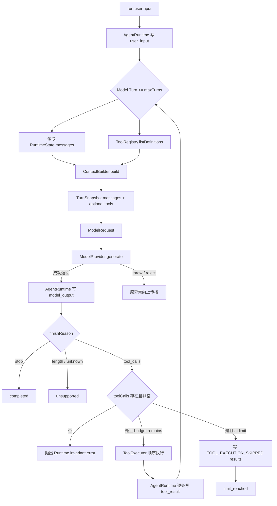

# Day08 / Part VII-D：ContextBuilder + TurnSnapshot

> Engineering Learning Log + Architecture Record  
> Milestone 状态：Done  
> 归档与代码复核日期：2026-09-14  
> 代码基线：`92dd6d8`（`feat(runtime): build independent context snapshots each turn`）

本文由三组证据交叉核对：

1. 当前仓库 `src/`、`test/`、工程配置与提交 `92dd6d8`，决定最终代码事实。
2. [Part VII-D 完整学习／架构讨论](https://chatgpt.com/g/g-p-6a62c8cc44e88191bb384ccd56dca50c/c/6aa26628-b1dc-83ee-b566-4df8c1a0c660)，用于还原 Architecture Analysis、Design Decision、Implementation Task、Code Review、Theory Feedback 与 Closure。讨论中上传 ZIP 的二进制内容不作为本次代码证据。
3. [Codex 实现、测试与 Debug 记录](source/day08-part-vii-d-codex-implementation-source.md)，保存本轮实现结论与归档复验结果。

本地完整页面文本归档：[架构讨论与任务（第 1～7 轮）](source/day08-part-vii-d-architecture-chatgpt-source.md)、[交付与 Review／Closure（第 8～9 轮）](source/day08-part-vii-d-review-chatgpt-source.md)。正文共 78,340 个 JavaScript UTF-16 字符，从此前已登录 Chrome 读取结果恢复；保留页面文本与引用标签，不声称恢复了附件内容或原始 Markdown。轮次标题由归档添加。

聊天中的候选 API、示意代码或早期理解不等于最终实现。下文凡描述现有行为，均已用当前源码和测试复核。

## 1. Milestone Goal

VII-C 已经能够在一次 `run()` 内完成 Model → Tool → Model，但模型请求仍由 `AgentRuntime` 直接从历史和 Registry definitions 组装。VII-D 的目标不是增加新的 Agent 能力，而是建立一条明确的输入投影链：

```text
RuntimeState
    ↓
ContextBuilder
    ↓
TurnSnapshot
    ↓
ModelRequest
    ↓
ModelProvider
```

这条边界把两个问题分开：

- `RuntimeState` 回答 Runtime 已经发生了什么。
- `TurnSnapshot` 回答下一次 Model Turn 真正能看到什么。

第一版仍完整投影全部消息和全部 Registry definitions。完成标准不是减少 Token，而是让“谁决定模型看到什么”成为真实代码职责，并确保 VII-C 的 Tool Loop、错误回流、`maxTurns`、skipped termination、Provider Error propagation 与跨 run 历史语义不回归。

## 2. Starting Point

本轮从提交 `64952ee` 的 VII-C 完成态演进，已有 45 项测试。

| VII-D 前的真实状态 | 本轮承接方式 |
| --- | --- |
| `RuntimeState` 只有 `messages` | schema 保持不变，不保存 Context 或 Snapshot |
| `AgentRuntime` 是唯一 State mutation owner | 继续负责写入 user、assistant、tool result |
| 每个模型回合直接 `getMessages().map(toModelMessage)` | 移入 `ContextBuilder.build()` |
| tools 由 `ToolRegistry.listDefinitions()` 提供 | Runtime 取 definitions，再显式交给 Builder |
| `toModelMessage()` 已负责单条消息映射 | 原样复用，不复制映射逻辑 |
| `ModelRequest` 是 Provider public contract | 保留，不用 Snapshot 替代 Provider 类型 |
| 同一 run 可包含多个 Model Turn | 每个 Turn 重新构建 Snapshot |
| 历史、Tool arguments、Schema 已有隔离保护 | 新增 Snapshot 输入／输出引用隔离 |

旧实现不是让 Provider 直接访问 `RuntimeState` 对象。它已经通过 ModelMessage 投影和 Registry clone 隔离部分引用。本轮要解决的是完整 Model Context 的组装责任仍内嵌于 Runtime，而不是修复“Provider 持有 State”的现有 Bug。

## 3. Architecture Questions

讨论没有从“新建哪个文件”开始，而是依次回答以下问题：

| 问题 | 关键矛盾 | 最终结论 |
| --- | --- | --- |
| D-1 State 与 Context 是否相同 | 当前确实全量发送历史，为什么还要分层？ | 内容暂时相同，职责和未来变化方向不同 |
| D-2 Builder 接收什么 | 整个 RuntimeState、最小数据，还是 State View？ | 显式接收 messages + tools |
| D-3 Snapshot 与 Request 的顺序 | 两者字段相同是否只是改名？ | Snapshot 是 Runtime 语义；Request 是 Provider 契约 |
| D-4 Snapshot 的“不变”是什么 | readonly、freeze、clone 是否等价？ | 当前只承诺 Reference Isolation |
| D-5 tools 是否属于 Context | Builder 只投影消息是否足够？ | messages 与可见 tools 共同构成完整 Turn 输入 |
| D-6 何时构建 | 每次 run 一次，还是每个 Model Turn 一次？ | 每次 `generate()` 前基于最新事实构建 |

用户在讨论中专门追问为什么是 `TurnSnapshot → ModelRequest`，而不是把 ModelRequest 当作所有 State 再截取 Snapshot。最终澄清是：长期事实属于 `RuntimeState`；`ModelRequest` 从 VII-A 起就是一次 `generate()` 的调用参数。旧实现恰好把全部历史放进每次 Request，才造成二者看似相同。

## 4. Design Decisions

### 最终采用方案

讨论中的八项候选最终收敛为六条正式 Architecture Decisions：

1. **D-AD01：RuntimeState 与 Model Context 解耦。** Context 是事实的投影，不再默认 `RuntimeState.messages == Model Context`。
2. **D-AD02：ContextBuilder 是纯投影组件。** 它没有 constructor dependency、内部可变状态或控制流责任。
3. **D-AD03：一个 Model Turn 对应一个独立 TurnSnapshot。** 每次 `generate()` 前重建。
4. **D-AD04：TurnSnapshot 与 ModelRequest 概念分离。** 保留 Provider contract；结构相同时不增加 Mapper。
5. **D-AD05：TurnSnapshot 包含 messages 与 tools。** 空工具集合继续省略 `tools`。
6. **D-AD06：Snapshot 保证 Reference Isolation。** 不引入 freeze 或 immutable framework。

### 讨论过但没有采用的方案

| 候选方案 | 未采用原因／最终处理 |
| --- | --- |
| `ContextBuilder.build(runtimeState)` | Builder 会依赖未来所有 Runtime-only 字段 |
| Builder 构造时持有 State、Registry、Provider | 会混淆 projection、ownership 与 control flow |
| 新增 `ContextSource` / State View class | 当前输入只有 messages + tools，属于提前抽象 |
| Builder 只返回 messages，Runtime 再拼 tools | 得到的是 Message Snapshot，不是完整 TurnSnapshot |
| Builder 直接返回 `ModelRequest` | 会把 Runtime 投影语义压回 Provider boundary |
| 新增 `turnSnapshotToModelRequest()` | 当前两者结构相同，只会重复复制字段 |
| 把 Snapshot 写入 `RuntimeState` | Snapshot 是派生执行数据，会形成重复事实源 |
| `Object.freeze` / `deepFreeze` | 当前验收需要引用隔离，不需要不可变对象系统 |
| `IContextBuilder`、Strategy、Policy、Pipeline | 只有一个真实策略时属于扩展点堆叠 |
| 为 Snapshot 增加 turnId、createdAt、tokenCount | 没有当前业务需求，只为制造类型差异 |

## 5. Why These Decisions

### State 与 Context 即使内容相同也要分开

当前 Builder 的策略是“全部保留”，但它把偶然行为变成了显式决策：

```text
过去：历史碰巧全部进入 Request
现在：ContextBuilder 明确把全部历史投影为本轮输入
```

未来 State 可能保存完整事实，而 Context 只包含 Summary、最近消息或按权限筛选的工具。只要变化发生在这条投影边界，Agent Loop 不必重新承担上下文策略。

### Builder 为什么只接收最小事实

`AgentRuntime` 知道 State 和 Registry 从哪里来，Builder 只需知道输入数据。这样依赖方向是：

```text
AgentRuntime gathers facts
        ↓
ContextBuilder projects facts
```

Builder 不会因 State 将来增加 `status`、`sessionId` 或 approval 信息而自动扩大依赖面，也不会成为第二个 Runtime owner。

### Snapshot 为什么属于 Model Turn

一次 run 可以发生多次模型调用。第一轮工具执行后，State 新增 `model_output(tool_calls)` 和 `tool_result`；第二轮如果重用 run 开始时的 Snapshot，就看不到工具结果。Snapshot 的核心语义首先是时间点：

```text
State S1 → Snapshot 1 → Model Turn 1
State S2 → Snapshot 2 → Model Turn 2
```

### Reference Isolation 为什么比 readonly 更关键

`readonly` 只约束 TypeScript 编译期写法，`Object.freeze` 默认只冻结外层。当前真正要防止的是嵌套 `toolCalls[].arguments` 或 `parameters.properties` 的共享引用反向污染事实。实现使用 `structuredClone()` 隔离整个投影，并通过主动 mutation 测试证明契约。

### Snapshot 与 Request 为什么不需要 Mapper

当前二者结构都是 `{ messages, tools? }`，但语义角色不同：Snapshot 是 Runtime 选定的本轮输入，Request 是 `ModelProvider.generate()` 的公开调用契约。代码使用 TypeScript structural typing：

```ts
const snapshot = this.#contextBuilder.build(...);
const request: ModelRequest = snapshot;
```

这保留概念边界，也避免一段没有转换价值的字段复制代码。当前 `request` 与 `snapshot` 是同一个对象引用；D-AD06 保护的是 Snapshot 与 Runtime facts／Registry definitions 的隔离，并未承诺 Request 与 Snapshot 再相互隔离。

## 6. Implementation Scope

实际范围只有一个投影组件、一次 Runtime 接线和边界测试：

```ts
interface ContextBuildInput {
  messages: readonly RuntimeMessage[];
  tools: readonly ToolDefinition[];
}

interface TurnSnapshot {
  messages: ModelMessage[];
  tools?: ToolDefinition[];
}

class ContextBuilder {
  build(input: ContextBuildInput): TurnSnapshot;
}
```

`ContextBuilder` 由 `AgentRuntime` 私有创建，没有注入选项。`RuntimeState` 仍为 messages-only；Provider、Provider Adapter、ToolRegistry、ToolExecutor、Tool Error Contract 与 termination 设计没有重构。

## 7. Code Changes

| 文件 | 实际变化 |
| --- | --- |
| [runtime/context-builder.ts](../../src/runtime/context-builder.ts) | 新增 `ContextBuildInput`、`TurnSnapshot` 与无状态 `ContextBuilder`；复用 `toModelMessage()`；整体 `structuredClone()`；空 tools 时省略字段 |
| [runtime/agent-runtime.ts](../../src/runtime/agent-runtime.ts) | 删除直接 mapping；在 for 循环每个 Model Turn 内取得最新 messages／definitions、构建 Snapshot，再作为 `ModelRequest` 调用 Provider |
| [test/context-builder.test.ts](../../test/context-builder.test.ts) | 新增四项投影、消息隔离、旧 Snapshot 稳定性、definition／Schema 隔离测试 |
| [test/tool-runtime.test.ts](../../test/tool-runtime.test.ts) | 新增逐 Model Turn 完整 Context 集成测试 |

提交还更新了仓库中的 `source-review.zip` 交付物。它不参与 Runtime 调用链，也不是本 Milestone 新增架构能力。

核心实现只有一个投影步骤，下面与当前源码一致：

```ts
return structuredClone({
  messages: input.messages.map(toModelMessage),
  ...(input.tools.length === 0 ? {} : { tools: [...input.tools] }),
});
```

先映射，再 clone：既有 mapper 决定消息字段语义，Builder 决定整轮输入及其引用边界。Runtime 直接交出私有 messages 数组，由 Builder 保证不修改它并隔离输出；`getMessages()` 仍作为对外读取历史的隔离 API 保留。这也避免为了构建 Snapshot 先调用 `getMessages()` 再复制一遍消息历史。

`package.json` 没有修改。现有：

```json
"test": "tsx --test test/**/*.test.ts"
```

已经自动包含新增 `test/context-builder.test.ts`，因此不需要为了 VII-D 增加测试脚本。严格测试类型检查继续使用项目既有显式命令；本轮没有把它包装成新 script，因为任务没有要求调整工程命令，且功能测试入口已经完整。

## 8. Runtime Verification

### 新增测试保护的契约

| 测试 | 保护内容 |
| --- | --- |
| projects all message kinds... | user、assistant、tool 三类消息、顺序、optional fields、Call / Result ID 配对；空 tools 字段省略 |
| snapshot array...cannot mutate input history | 修改消息、数组、call id、嵌套 arguments 和 result 不污染输入历史 |
| later input mutations... | 构建后修改来源并再次 build，旧 Snapshot 保持构建时内容 |
| snapshot tools match... | definitions 与 Registry 一致；name、description、properties、required 和数组双向隔离 |
| each turn gets independent... | 第二轮看见最新 Tool Result 和动态新增 definition；两轮请求相互隔离 |

集成测试特意在 `add` 执行过程中注册 `second` 工具：

```text
Turn 1 tools = [add]
    ↓ execute add; register second
Turn 2 tools = [add, second]
Turn 2 messages = user → assistant(tool call) → tool(result)
```

它同时证明 Snapshot 是 turn-level、读取最新 State、读取最新 definitions，且 Tool Call / Result 协议没有被投影层破坏。

这里的证据没有被 Mock 的额外复制掩盖：`MockModelProvider.generate()` 直接执行 `this.requests.push(request)`，保留传入对象引用。测试检查的就是 Runtime 交给 Provider 的请求。动态注册 `second` 是测试刺激，没有新增 Context 插件或动态策略 API。

### 2026-09-14 归档复验

| 命令 | 实际结果 |
| --- | --- |
| `npm test` | 50 pass、0 fail，退出码 0 |
| `npm run build` | 通过，退出码 0 |
| 额外严格测试 TypeScript type-check | 无诊断，退出码 0 |
| `npm run demo:tools` | 两个 Model Turn、一次 add、completed，退出码 0 |

额外类型检查命令为：

```bash
./node_modules/.bin/tsc --noEmit --target ES2022 \
  --module NodeNext --moduleResolution NodeNext \
  --allowImportingTsExtensions --strict --noUncheckedIndexedAccess \
  --exactOptionalPropertyTypes --skipLibCheck \
  test/*.test.ts test/support/*.ts
```

确定性 Demo 的关键输出：

```text
Model turn 1: add {"a":2,"b":3}
Tool execute: add(2, 3) = 5
Model turn 2 received tool_result: {"success":true,"result":5}
RunOutcome: {"type":"completed"}
History: user_input -> model_output -> tool_result -> model_output
```

## 9. Bugs / Debugging

可核对的交付总结与本次复验均通过；现有证据没有记录 VII-D 本地测试失败后修复的过程，因此不虚构一次红灯到绿灯的 Debug 历史。下面区分实现时防范的风险、评审观察与实际环境失败。

### 嵌套引用风险

`toModelMessage()` 会创建新的消息外壳，但 assistant 的 `toolCalls`／`arguments` 仍可能携带嵌套引用；`[...input.tools]` 也只复制 tools 数组。若 Builder 只做这些浅层操作，Provider 修改嵌套 arguments 或 JSON Schema 仍可能污染 Runtime facts 或 definitions。

最终实现对完整投影做一次 `structuredClone()`，并用 mutation tests 验证，而不是只依赖类型声明。

这是一项实现时防范并验证的风险，现有记录没有显示曾提交过浅复制版本，不能把它写成已发生的生产故障。另一个边界是：Snapshot 自身仍可修改，Provider 修改它不会改写事实源，但可能改变自己保留的这份请求；本轮没有提供对象冻结或审计快照存储能力。

### 双重 clone 的评审判断

`ToolRegistry.listDefinitions()` 已经 clone definitions，Builder 又 clone 完整 Snapshot，工具定义因此会经过两次复制。Review 将其记录为非阻塞观察：当前工具和 Schema 很小，模型调用成本远高于 clone；边界清晰与隔离正确优先。本轮没有为了微小优化破坏 Registry 或 Builder 的独立契约。

### Review 环境与本机证据的区分

ChatGPT Review 对上传 ZIP 做源码核对时，隔离环境缺少 `node_modules`，独立执行 `npm test` 得到 `tsx: not found`。这不是仓库实现失败。会话中的 50/50、build、type-check 与 demos 是用户本机贴回的证据；本次归档又在当前工作区独立复验并全部通过。

### `package.json` 测试命令判断

讨论后又核对了是否需要补测试命令。结论是无需修改：新增测试已经被 `test/**/*.test.ts` 捕获。需要的是功能测试本身，而不是为了显示“新增测试”再造一个等价 npm script。

## 10. Code Review Findings

最终 Review 结论为 **PASS，Must Fix = 0**。

| 检查项 | 结论 |
| --- | --- |
| Builder 是否真实进入调用链 | 是，位于 `for` 循环内部、每次 generate 之前 |
| State / Context 是否解耦 | 是，Runtime 不再直接 mapping Request |
| Builder 是否纯 | 是，无依赖、无内部 state、无 Tool／Loop／termination 行为 |
| mapping 是否重复 | 否，继续使用 `toModelMessage()` |
| Snapshot 是否完整 | 是，包含 messages + optional tools |
| 空 Registry 语义 | 保持省略 `tools` |
| 引用隔离 | 覆盖消息、arguments、definitions 与嵌套 Schema |
| 每 Turn 最新事实 | 集成测试证明第二次请求读取最新消息和工具 |
| Call / Result 配对 | ID 与顺序保持 |
| VII-C regression | 既有测试预期未为本轮修改，全部通过 |
| Scope expansion | 未发现 |

两个无需修改的理解点：

- `TurnSnapshot` 与 `ModelRequest` 当前 shape 相同是预期，不应合并，也不应通过添加 metadata 强行制造差异。
- ContextBuilder 当前完整投影全部事实并不表示边界无价值；本轮解决 Context Boundary，尚未解决 Context Optimization。

## 11. Theory Feedback

### Context 是 Projection

本轮把早期理论从口头约定变成了运行时代码：

```text
State ≈ Context
```

升级为：

```text
Runtime Facts
    ↓ projection
Model Context
```

这意味着 Runtime 可以知道比模型当前需要看到的更多信息。上下文裁剪、Summary、Memory 与 Tool visibility 若未来出现，应该改变投影，而不是删除或改写事实源。

### Snapshot 是 Temporal Boundary

Snapshot 的首要含义不是 readonly，而是“某个 Model Turn 开始前已经确定”。旧 Snapshot 不随 State 更新而变化，新事实只能进入后续 Snapshot。Reference Isolation 是让这个时间点语义在可变对象环境中成立的工程手段。

### Derived Data 不应成为第二事实源

`TurnSnapshot` 可以从 State 与 definitions 重建，因此不进入 `RuntimeState`。若保存 `currentContext` 或 `lastSnapshot`，Runtime 就必须同步两套可变表示，并处理谁才是 Source of Truth。

### ContextBuilder 是策略发生的位置，不是预先建立的策略框架

当前真实策略只有“全部消息 + 全部工具”。边界已经存在，但没有 `ContextPolicy`、Strategy interface 或插件系统。等出现第二种真实策略，再决定怎样抽象。

## 12. Pi Mapping

本轮只记录 State → Context 投影这一相关对照。以下具体函数名回查仓库已有 [Day07 State / Context 学习记录](../day07-pi-agent-source-analysis/day07-session-02-state-and-context-projection.md)，作为旧学习的回扣；本轮没有重新检出或验证最新版 Pi 源码。

| Mini Runtime VII-D | Pi 学习记录中的对应机制 | 相同点与差异 |
| --- | --- | --- |
| `RuntimeState` | Pi `AgentState` | 都保存 Runtime 长期事实；Mini 当前只有 messages |
| `ContextBuilder.build()` | Pi 的 State → Context projection、`transformContext` | 都拒绝把 State 直接等同于模型输入；Mini 当前固定全量投影 |
| `TurnSnapshot` | Pi `createContextSnapshot()` 形成的 `AgentContext` | 都建立 Snapshot 边界；Pi Context 还含 systemPrompt、messages、tools，且服务更完整 Loop |
| `toModelMessage()` | Pi `convertToLlm` 链的一部分 | 都把 Runtime message 转成模型协议层可见消息；Mini Provider adapter 仍独立处理厂商格式 |
| 每次 tool result 后重建 | Pi `currentContext.messages.push(result)` 后继续模型调用 | 都闭合 Tool Result → Context → Model 回路 |

不能把二者说成同一个实现：Pi 的 `createContextSnapshot()` 在 Agent 与 Loop 之间创建运行上下文，Mini 的 `TurnSnapshot` 明确定义为一次 Model Turn 的完整模型输入；Pi 还有 transform hook、system prompt、事件与更丰富执行能力，本轮没有复制这些机制。

已有 Pi 学习记录中的 snapshot 使用 messages／tools 数组浅复制，不能据此推断 Pi 与本轮具有相同的嵌套引用隔离保证。Mini 此次的完整 `structuredClone()` 是 D-AD06 的具体实现选择。

## 13. Architecture Decisions Added

| ID | 决策 | 当前代码证据 |
| --- | --- | --- |
| D-AD01 | State 与 Context 解耦 | Runtime 交给 Builder 投影，State schema 不变 |
| D-AD02 | Builder 是纯投影组件 | 只有 `build(input)`，无 constructor dependency |
| D-AD03 | 每个 Model Turn 一个 Snapshot | `build()` 位于 `for` 循环内部、`generate()` 之前 |
| D-AD04 | Snapshot 与 Request 概念分离 | 两个 interface 均保留，结构兼容赋值 |
| D-AD05 | Snapshot 覆盖 messages + tools | `TurnSnapshot` 两字段；空 tools 省略 |
| D-AD06 | 保证引用隔离 | 整体 `structuredClone()` + mutation tests |

这六条是本轮新增的正式记录。Tool Call / Result 配对是 Acceptance Criterion；Snapshot 不入 State 是 D-AD01／D-AD03 的直接结果，没有另造编号。

## 14. Deferred Work

| 故意未实现 | 后续位置／状态 |
| --- | --- |
| AgentEvent、Subscriber、Logger／UI observation | Part VII-E |
| Streaming | 如 v1 需要，只能随 VII-E Event／Subscriber 讨论，不单开 Part |
| Abort、Single Active Run、并发写保护 | Part VII-F |
| SessionStore、Conversation Recovery | Part VII-G |
| Provider failure 后 retry current step 与再次 `run()` 的区分 | 等 VII-G recovery 或真实 Retry 需求 |
| `beforeToolCall`、简单 Approval | Part VII-H |
| 完整 Weather Agent | Part VII-I |
| history trimming、Context Window、Token Budget | 当前 v1 未分配具体实现 Part，出现真实需求后另行规划 |
| Summary、Compaction、Memory、RAG | 本 Milestone 明确排除；不假定已经进入 VII-E～VII-I |
| Tool visibility / permission policy | 当前 Registry definitions 全部可见；随权限真实需求再设计 |
| Context Integrity | 将来裁剪时必须成对维护 assistant tool call 与 tool result |
| Builder injection、多实现、Policy／Strategy／Pipeline | 第二种真实 Context 策略出现后再评估 |

## 15. Final Architecture Snapshot

当前真实调用关系如下：



Ownership 保持明确：

```text
AgentRuntime   = control flow + State mutation
RuntimeState   = Runtime facts
ContextBuilder = per-turn context projection
TurnSnapshot   = one Model Turn input
ModelProvider  = provider-neutral invocation contract
ToolRegistry   = executable catalog + definitions source
ToolExecutor   = one Tool Call execution boundary
```

## 16. Core Knowledge Upgrade

本轮真正升级的知识不是“如何写一个 25 行的 Builder”，而是以下四点：

1. **State 不等于 Context。** State 是事实源，Context 是针对一次推理的选择与转换。
2. **Snapshot 表达时间点。** 每次 Model Turn 都应得到独立输入；readonly 不能替代时间点隔离。
3. **完整输入不只包含 messages。** 当前可见工具同样影响模型决策，因此属于 TurnSnapshot。
4. **架构边界可以先于高级策略成立。** 即使策略仍是全量投影，Loop 已不再负责上下文选择；未来演进有了稳定位置。

工程上还形成了一条更精确的判断标准：相同字段不代表相同概念；不同概念也不必强制产生重复 Mapper。要看 ownership、生命周期、变化原因和契约边界。

## 17. Next Milestone

下一阶段进入 **Part VII-E：AgentEvent + Subscriber**。

截至 VII-D，Runtime 已回答：模型怎样调用、谁拥有状态、工具怎样执行、每次 Model Turn 看见什么。VII-E 要回答 Runtime 内部过程怎样被上层 UI、Logger 与 Observability 消费。

下一步先进行 Architecture Analysis，重点确定事件事实、发出时机、Subscriber 边界与错误影响；不直接搭建复杂 Event Bus、Telemetry Framework 或 Streaming Engine。

```text
Part VII-A  ✅ Foundation + ModelProvider
Part VII-B  ✅ RuntimeState + Agent Loop
Part VII-C  ✅ Tool Registry + Executor + Error Contract
Part VII-D  ✅ ContextBuilder + TurnSnapshot
Part VII-E  → AgentEvent + Subscriber
Part VII-F    Abort + Single Active Run
Part VII-G    SessionStore + Conversation Recovery
Part VII-H    beforeToolCall + Approval
Part VII-I    Weather Agent
```
