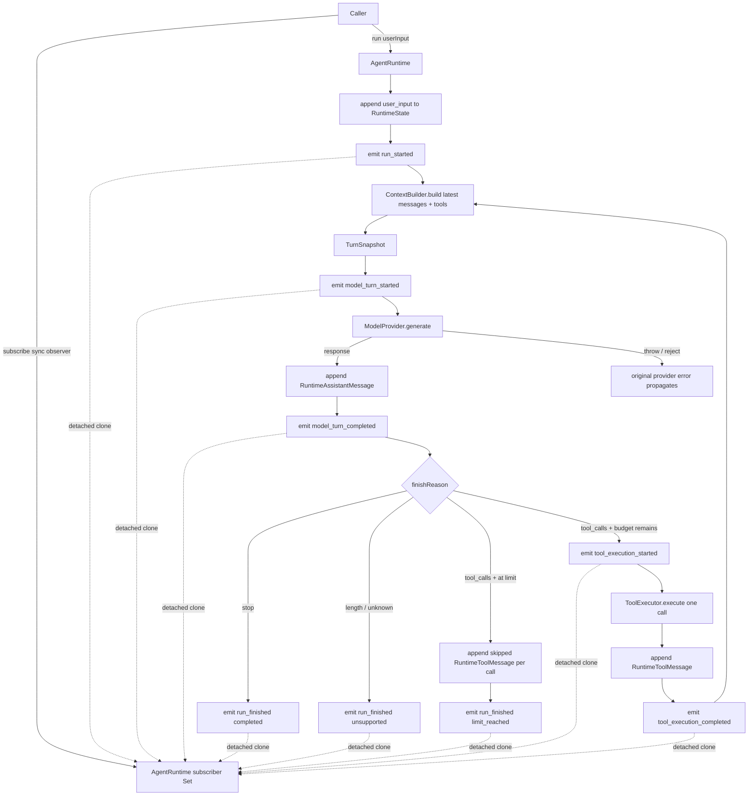

# Day08 / Part VII-E：AgentEvent + Subscriber

> Engineering Learning Log + Architecture Record
>
> Milestone 状态：Done
>
> 归档与代码复核日期：2026-09-17
>
> 代码基线：`e3efa9b`（Runtime Event 主体实现）+ `9d06865`（同步 Subscriber Contract 修复）

本文由三组证据交叉核对：

1. 当前仓库的 `src/`、`test/`、工程配置以及提交 `e3efa9b`、`9d06865`，决定最终代码事实。
2. [Part VII-E 完整学习／架构讨论](https://chatgpt.com/c/6aa8fe11-eadc-83e9-951d-26d3f4c62170)，用于还原 Architecture Analysis、Design Decision、Code Review、Theory Feedback 与 Closure。聊天中的候选方案和示意类型不是当前代码事实。
3. Codex 本轮实际实现、测试和 Debug 过程，包括初版 60 项测试、两个 deterministic demo、Review 后同步契约修复，以及最终 test／build／strict type-check／diff check。

本地 source 归档：[架构讨论与 Implementation Task](source/day08-part-vii-e-architecture-chatgpt-source.md)、[交付、Code Review 与 Closure](source/day08-part-vii-e-review-chatgpt-source.md)、[Codex 实现、测试与 Debug 证据](source/day08-part-vii-e-codex-implementation-source.md)。前两份通过 conversation connector 校验会话 ID，再由 `read_thread` 取得全部 10 个 turn 并按时间顺序重建为完整正文；上传附件的二进制内容不重复嵌入，保留接口返回的附件标记。

当前源码优先级最高。尤其是 Subscriber Contract：早期实现和部分讨论曾写成 `(event: AgentEvent) => void`，最终代码已经修正为 `(event: AgentEvent) => undefined`。本文只把前者记录为被 Review 发现并淘汰的方案。

## 1. Milestone Goal

VII-A～VII-D 已让 Runtime 能调用模型、保存事实、执行工具，并为每个 Model Turn 构建独立 Context。VII-E 不增加新的控制能力，而是在主执行链旁建立最小 Observation Channel：

```text
AgentRuntime
    ↓ runtime lifecycle
AgentEvent
    ↓
Subscriber
    ↓
UI / Logger / Debug / Observability
```

目标不是“做一个 EventEmitter”，而是回答：

> Runtime 外部怎样观察执行过程，同时不获得 State mutation、Tool approval、Abort 或 Loop control 权力？

完成标准包括：

- Run、Model Turn、Tool Execution 三层生命周期可以被观察。
- Completed Event 表示对应 Runtime fact 已提交。
- Subscriber 是同步、best-effort Observer。
- Subscriber 修改 payload 或同步抛错都不能改变 Runtime 事实和结果。
- `maxTurns` skipped、Provider error、Runtime invariant error 继续保持 VII-C／VII-D 语义。
- 不把 Event 变成 State、Event Log、Control Hook、Streaming 或 Telemetry Framework。

## 2. Starting Point

本轮从提交 `92dd6d8` 的 VII-D 完成态继续，已有 50 项测试。起点的真实职责如下：

| VII-E 前的真实状态 | 本轮承接方式 |
| --- | --- |
| `RuntimeState` 只有 `messages` | schema 不变，不保存 event、subscriber 或 event history |
| `AgentRuntime` 拥有 control flow 和全部 State mutation | 继续由 Runtime 决定何时发 event |
| 每个 Turn 通过 `ContextBuilder` 构建 `TurnSnapshot` | 在 build 后、`generate()` 前发 model started |
| Model output 先写 State，再解释 `finishReason` | 写入后发 model completed |
| Tool Calls 按顺序通过 `ToolExecutor` 执行 | 每个真实执行形成 started／completed pair |
| Tool Error Contract 返回成功或错误结果 | 二者统一使用 tool completed，不增加 failed event |
| 最后一轮 Tool Calls 写 skipped result，不执行 Tool | 不伪造任何 tool execution event |
| Provider error 和 invariant error 向上传播 | 不新增 failed outcome 或 generic error event |
| 外部只有 `run()` 和 `getMessages()` | 新增 `subscribe()` 作为观察入口 |

因此本轮是在现有 Agent Loop 的明确位置增量接线，不重写 Loop，也不重新设计 Provider、Context 或 Tool 层。

## 3. Architecture Questions

讨论先回答语义问题，再决定文件和 API：

| 问题 | 关键矛盾 | 最终结论 |
| --- | --- | --- |
| E-1 Event 是什么 | State 副本、Event Log，还是 lifecycle observation？ | Event 描述可观察的 Runtime lifecycle，不是 State 或 Control |
| E-2 发哪些 Event | 所有内部函数调用，还是稳定的 Runtime 语义？ | 只保留 Run、Model Turn、Tool Execution 六类事件 |
| E-3 何时发 completed | Provider／Executor 返回后，还是 fact commit 后？ | 对应 Runtime message 写入 State 后再发 |
| E-4 Subscriber 是 Observer 还是 Hook | 是否能返回 allow／deny／stop？ | 只能观察，返回值不控制 Runtime |
| E-5 Subscriber 失败怎么办 | Logger／UI 失败是否应让 run 失败？ | 同步异常逐个隔离，其他 Subscriber 与 Runtime 继续 |
| E-6 同步还是异步 | await 会产生 backpressure；fire-and-forget 有顺序和 rejection 问题 | 第一版只接受同步 callback |
| E-7 payload 用什么语言 | 暴露 raw Provider／Executor 对象，还是 Runtime facts？ | 使用 `RuntimeAssistantMessage`、`RuntimeToolMessage`、`ToolCall`、`RunOutcome` |
| E-8 如何保护所有权 | clone 一次共享，还是每个 Subscriber 独立 clone？ | 每次通知单独 `structuredClone()` |
| E-9 是否加入 metadata | runId、turnId、timestamp 是否现在就需要？ | 没有当前需求，不增加 |
| E-10 Streaming 是否一起做 | UI 可观察是否等于 token stream？ | 不等于；Provider 仍是完整 `ModelResponse`，Streaming 延期 |

讨论中一个重要澄清是：UI 中的“正在调用模型／正在执行工具”接近 Runtime Event，但不是 LLM 私有思考过程。VII-E 暴露的是 Runtime 客观知道的执行事实，不暴露 chain-of-thought。

## 4. Design Decisions

### 最终采用方案

1. **E-AD01：AgentEvent 是 Observation，不是 State 或 Control。** Event 不重建 State，Subscriber 不决定执行。
2. **E-AD02：Event Model 只描述 Runtime-level lifecycle。** 第一版只有六种事件。
3. **E-AD03：Completed Event 在对应 Runtime fact commit 后发出。** Subscriber 读取 history 时不会看到“事件已完成、事实尚未写入”的中间态。
4. **E-AD04：Subscriber 是同步 Observer。** 最终类型为 `(event: AgentEvent) => undefined`，在 TypeScript 层拒绝 async callback。
5. **E-AD05：Subscriber failure 与 Runtime failure 解耦。** 一个同步 throw 不影响 run，也不阻止其他 Subscriber。
6. **E-AD06：Event payload 使用 Runtime language，并保证 Reference Isolation。** 每个 Subscriber 得到独立 clone。
7. **E-AD07：第一版不增加 Observability Metadata。** 不增加 runId、turnId、timestamp、sequence、traceId、duration 或 metadata。

最终 Public Event Contract 与当前源码一致：

```ts
type AgentEvent =
  | { type: "run_started" }
  | { type: "model_turn_started" }
  | { type: "model_turn_completed"; message: RuntimeAssistantMessage }
  | { type: "tool_execution_started"; toolCall: ToolCall }
  | { type: "tool_execution_completed"; message: RuntimeToolMessage }
  | { type: "run_finished"; outcome: RunOutcome };

type AgentEventSubscriber = (event: AgentEvent) => undefined;
```

订阅 API：

```ts
const unsubscribe = runtime.subscribe((event) => {
  observe(event);
});

unsubscribe();
```

### 讨论过但没有采用／最终被修正的方案

| 候选方案 | 未采用原因／最终处理 |
| --- | --- |
| Event Sourcing、Event replay、EventStore | 本轮 Event 不是事实源，不用于恢复 Runtime |
| 把 events／subscribers 加入 `RuntimeState` | 执行基础设施不属于 conversation facts |
| 暴露 context built、registry lookup、state append 等内部事件 | 会把 Public Contract 绑定到实现细节 |
| `run_completed`／`run_unsupported`／`run_limit_reached` 三类事件 | 复用已有 `RunOutcome`，统一为 `run_finished` |
| tool succeeded／tool failed 两类 completed event | Tool Error Contract 已表达结果；completed 表示 lifecycle 形成最终 result，不等于业务成功 |
| 模型产生 Tool Call 就发 tool started | Tool Call 是请求，不等于 Runtime 已开始执行；`maxTurns` 已证明两者必须分开 |
| skipped tool event | 当前没有真实需求；skipped 是写入 State 的 termination pairing，不是真实 Tool execution |
| raw `ModelResponse`／raw `ToolResult` 作为 completed payload | Public Event 应使用 Runtime 已接受的 message fact |
| 所有 Subscriber 共享同一个 cloned Event | 前一个 Subscriber 仍可污染后一个 Subscriber 的观察值 |
| deepFreeze／immutable library | Reference Isolation 已满足 ownership；无需增加依赖和对象系统 |
| Async Subscriber、await、`Promise.all` | 会引入 backpressure、latency 和新的 failure semantics |
| fire-and-forget Promise callback | rejection、顺序、run settlement 都没有基础设施承接 |
| EventBus、Middleware、Hook、priority、filter、once | 当前一个 `Set` 和私有 emit 已足够 |
| Token／delta event | 会要求修改 ModelProvider、Adapter、聚合与消息生命周期，超出本轮 |
| 初版 `(event) => void` | TypeScript 会接受 async／value-returning callback；Review 后改为 `undefined` |

## 5. Why These Decisions

### Observation 与 Execution 必须分开

Runtime Core 的成功不应依赖 Logger 或 UI 是否工作。Subscriber 如果能返回 allow／deny、修改 request 或停止 loop，它就不再是 Observer，而是 Control Hook。Abort 属于 VII-F，Approval 属于 VII-H，不能借 Event API 提前实现。

```text
Runtime execution
   ├─ mutate RuntimeState
   └─ emit detached observation
```

Event 是旁路输出，不是推进 Runtime 的输入。

### Runtime-level lifecycle 比 class-level tracing 稳定

`model_turn_started` 表达 Agent 正在进入一次模型回合；它不要求 UI 知道具体 Provider class。`tool_execution_completed` 表达执行形成了最终 Runtime message；它不暴露 Registry lookup、AJV validation 或 ToolExecutor 内部步骤。

只要 Runtime 语义不变，内部 class 重构不应迫使所有 Subscriber 改写。

### Completed Event 是 Committed Observation

最终顺序是：

```text
Provider.generate()
    ↓
Runtime 接受 response
    ↓
append model_output
    ↓
emit model_turn_completed
```

以及：

```text
ToolExecutor.execute()
    ↓
serialize RuntimeToolMessage
    ↓
append tool_result
    ↓
emit tool_execution_completed
```

这让 completed 的含义不是“底层调用刚返回”，而是“Runtime 已接受并提交对应事实”。它与数据库中先 commit、再对外宣布完成的思路相似。

### Tool Call 不等于 Tool Execution

模型输出 Tool Call 只说明模型请求执行。Runtime 可能因为 `maxTurns` 不执行；未来还可能因 Abort 或 Approval 不执行。因此：

```text
model_output(toolCalls)
≠
tool_execution_started
```

只有 Runtime 确定本轮真实进入 `ToolExecutor.execute()` 时才发 started。

### 同步契约必须由类型真正表达

早期采用：

```ts
type AgentEventSubscriber = (event: AgentEvent) => void;
```

但 TypeScript 对 `void` callback 有特殊兼容规则：调用方声明忽略返回值，不代表实现不能返回值。因此 `async () => {}` 仍可赋值，Runtime 的同步 `try/catch` 也捕获不到 rejected Promise。

最终改为：

```ts
type AgentEventSubscriber = (event: AgentEvent) => undefined;
```

在 TypeScript 5.8 下，同步无返回 block callback 仍合法，而 `Promise<void>` 不可赋给 `undefined`。这是 Public Contract 与 implementation capability 对齐，而不是在 Runtime 中偷偷支持 async。

### 每 Subscriber clone 同时保护两条边界

只 clone 一次再广播，可以保护 RuntimeState，但 Subscriber A 仍能修改对象并影响 Subscriber B。当前实现把 clone 放在循环内：

```ts
for (const subscriber of [...this.#subscribers]) {
  try {
    subscriber(structuredClone(event));
  } catch {
    // observation failure is isolated
  }
}
```

由此同时成立：

```text
Subscriber mutation ≠ Runtime mutation
Subscriber A mutation ≠ Subscriber B observation
```

当前 payload 很小，正确的 ownership boundary 优先于尚无证据的 clone 性能优化。

## 6. Implementation Scope

实际范围保持为一个类型文件、一次 Runtime 接线和一组测试：

```text
src/runtime/agent-event.ts
src/runtime/agent-runtime.ts
test/agent-event.test.ts
```

`AgentRuntime` 新增：

```ts
readonly #subscribers = new Set<AgentEventSubscriber>();

subscribe(subscriber: AgentEventSubscriber): () => void;
#emit(event: AgentEvent): void;
#finish(outcome: RunOutcome): RunOutcome;
```

`#finish()` 只是确保所有正常形成的 `RunOutcome` 在 return 前统一发 `run_finished`。它没有新增 outcome，也不处理异常路径。

未修改：

- `RuntimeState` schema；
- `ContextBuilder` 和 `TurnSnapshot`；
- `ModelProvider` contract 与 OpenAI adapter；
- `ToolRegistry`、`ToolExecutor`、Tool Error Contract；
- `maxTurns`、skipped pairing 和 termination semantics；
- 任何第三方 dependency。

## 7. Code Changes

| 文件 | 实际变化 |
| --- | --- |
| [runtime/agent-event.ts](../../src/runtime/agent-event.ts) | 新增六分支 `AgentEvent` union 和同步 `AgentEventSubscriber`；最终 return type 为 `undefined` |
| [runtime/agent-runtime.ts](../../src/runtime/agent-runtime.ts) | 新增 `Set`、subscribe／unsubscribe、私有 emit、统一 finish；在现有 Loop 的 commit／execution 点增量发事件 |
| [test/agent-event.test.ts](../../test/agent-event.test.ts) | 新增 10 项 Runtime Event 测试和同步 Subscriber 编译期证据 |

两次实现提交还更新了 `source-review.zip` 交付物。它不参与 Runtime 调用链，不构成本轮架构能力。

当前 Event 类型精确复用真实 Runtime type：

- `model_turn_completed.message` 是 `RuntimeAssistantMessage`，不是任务示意中的新 `ModelOutputMessage`。
- `tool_execution_completed.message` 是 `RuntimeToolMessage`，不是复制出的 `ToolResultMessage`。
- `tool_execution_started.toolCall` 复用 `ToolCall`。
- `run_finished.outcome` 复用 `RunOutcome`。

`subscribe()` 返回的 closure 只执行 `Set.delete()`；重复 unsubscribe 是自然 no-op，不引入额外 lifecycle state。

类型文件存在一个已知 type-only dependency cycle：

```text
agent-runtime.ts --type--> agent-event.ts
agent-event.ts   --type--> agent-runtime.ts (RunOutcome)
```

两端都是 `import type`，不会形成 JavaScript runtime cycle。Review 决定不为此提前拆 `run-outcome.ts` 或 `runtime-contracts.ts`；当 Runtime public contracts 真实增多时再评估。

## 8. Runtime Verification

### 新增测试保护的契约

| 测试 | 保护内容 |
| --- | --- |
| normal run emits... | normal lifecycle 顺序；`run_started` 时 user input 已提交；finished outcome 与 return 一致 |
| tool loop events... | 两轮模型、一次 Tool 的完整顺序；model／tool completed 时 history 已含对应 message |
| multiple tools emit... | A started → A execute → A completed → B started → B execute → B completed |
| tool error contract... | TOOL_NOT_FOUND 仍形成 started／completed，同一个 completed payload 携带错误 result message |
| maxTurns writes skipped... | 写 `TOOL_EXECUTION_SKIPPED`，但没有任何 tool execution event；最终 limit_reached |
| each subscriber receives... | 嵌套 ToolCall arguments、tool result message、RuntimeState、Subscriber 间均隔离；原始参数实际执行成功 |
| run_finished outcome... | Subscriber 修改 cloned `maxTurns` 不改变 `run()` 返回值 |
| subscriber failures... | A 同步 throw；B 仍收到同一事件和后续事件；run completed |
| unsubscribe... | callback 在首个事件中取消后不再接收后续事件；重复调用安全 |
| provider errors... | 只收到 run started／model started；原错误向上传播；无 run finished |

编译期证据位于同一个测试文件：

```ts
const synchronousSubscriber: AgentEventSubscriber = () => {};

// @ts-expect-error async subscribers are intentionally unsupported
const asynchronousSubscriber: AgentEventSubscriber = async () => {};
```

若 async callback 不再产生类型错误，strict type-check 会因未使用的 `@ts-expect-error` 失败。因此这不是注释声明，而是可执行的 contract evidence。

### 最终验证结果

| 命令 | 实际结果 |
| --- | --- |
| `npm test` | 60 pass、0 fail |
| `npm run build` | 通过，无 TypeScript 诊断 |
| 额外严格测试 TypeScript type-check | 通过，无诊断 |
| `git diff --check` | 通过 |
| `npm run demo:runtime` | 主体实现阶段通过；两次 run 均 completed，跨 run history 正常 |
| `npm run demo:tools` | 主体实现阶段通过；两 Model Turn、一次 add、completed |

严格测试类型检查命令仍为：

```bash
./node_modules/.bin/tsc --noEmit --target ES2022 \
  --module NodeNext --moduleResolution NodeNext \
  --allowImportingTsExtensions --strict --noUncheckedIndexedAccess \
  --exactOptionalPropertyTypes --skipLibCheck \
  test/*.test.ts test/support/*.ts
```

没有新增 npm test script。现有 `tsx --test test/**/*.test.ts` 自动包含 `agent-event.test.ts`；compile-time contract 继续由项目既有 strict test type-check 命令验证。

### 关键事件序列

正常无 Tool：

```text
append user_input
run_started
model_turn_started
Provider.generate
append model_output
model_turn_completed
run_finished(completed)
return completed
```

正常 Tool Loop：

```text
run_started
model_turn_started
append model_output(toolCalls)
model_turn_completed
tool_execution_started
ToolExecutor.execute
append tool_result
tool_execution_completed
model_turn_started
append final model_output
model_turn_completed
run_finished(completed)
```

`maxTurns` 最后一轮：

```text
model_turn_completed
append TOOL_EXECUTION_SKIPPED result(s)
run_finished(limit_reached)
```

没有 tool execution event。

Provider error：

```text
run_started
model_turn_started
Provider throws / rejects
original error propagates
```

没有 `run_finished`，因为没有形成合法 `RunOutcome`。

## 9. Bugs / Debugging

### 9.1 功能测试全绿，但 Public Type Contract 仍然错误

主体实现最初定义：

```ts
type AgentEventSubscriber = (event: AgentEvent) => void;
```

当时 60 项 Runtime tests、build、strict test type-check 和 demos 都能通过。Code Review 仍发现 E-AD04 没有真正成立：TypeScript 允许 Promise-returning function 赋给 void-returning callback。

这不是纯类型洁癖。实现中的 `try/catch` 只能捕获同步 throw：

```ts
try {
  subscriber(event);
} catch {}
```

async callback 的异常会变成 rejected Promise，从这个 catch 边界逃逸。最终修复不是增加 Promise handling，而是把类型收紧为 `undefined`，与本轮“同步 Observer only”的能力边界一致。

这个 Debug 说明：

> Runtime behavior tests 证明已实现路径正确，但不能自动证明 Public Type Contract 排除了不支持的调用方式。

### 9.2 incidental return 暴露了 callback contract 的真实影响

测试里曾使用：

```ts
runtime.subscribe((event) => events.push(event));
```

`Array.push()` 返回 `number`。改成 `undefined` contract 后，这种 callback 正确地不再兼容。测试统一改成显式 block：

```ts
runtime.subscribe((event) => {
  events.push(event);
});
```

这不是为了迁就测试，而是让调用者明确表达“只观察，不返回控制值”。

### 9.3 `npm test` 不等于完整 TypeScript Contract 验证

`tsx --test` 负责执行测试，但不会替代完整 `tsc` contract check。`@ts-expect-error` 证据只有在额外 strict type-check 中才会被验证。因而最终验证必须同时保留：

```text
runtime tests
+ build
+ strict test type-check
```

### 9.4 引用隔离测试从失败结果改为真实成功执行

初版 mutation 测试给 ToolCall 增加嵌套 metadata，但复用了不允许额外字段的 add Schema，因此工具形成 `INVALID_ARGUMENTS`。测试虽能证明 Event clone，却不能直接证明 subscriber 篡改 started payload 不会改变 Tool 真正收到的参数。

最终改为注册接受嵌套 metadata 的 `inspect` 工具，并返回嵌套 result：

```text
Event subscriber 修改自己的 arguments clone
    ↓
ToolExecutor 仍收到 original
    ↓
result.nested.label = original
```

测试由“错误路径也未污染 State”加强为“真实成功执行仍保持端到端隔离”。

### 9.5 没有为绿色测试新增重复命令

评审中再次确认是否需要新增测试命令。结论是不需要：现有 glob 已发现新测试；strict test type-check 也已有明确命令。Milestone 需要新增测试证据，不需要为了形式增加等价 npm script。

## 10. Code Review Findings

最终 Review 结论：**PASS，Must Fix = 0 remaining**。

第一轮 Review 的唯一 Must Fix 是同步 Subscriber contract。修复后检查如下：

| 检查项 | 最终结论 |
| --- | --- |
| Event 是否进入 State | 否 |
| Subscriber 是否获得 Control | 否 |
| Event 是否只覆盖三层 lifecycle | 是 |
| completed 是否在 commit 后 | 是，测试在 callback 内读取 history 证明 |
| Tool Call 是否被误当 execution started | 否，maxTurns 测试证明 |
| error Tool Result 是否仍 completed | 是 |
| Provider error 是否被吞掉／转换 | 否，原对象传播 |
| Subscriber 同步 throw 是否隔离 | 是，其他 Subscriber 和 run 继续 |
| async callback 是否被类型拒绝 | 是，`undefined` + `@ts-expect-error` |
| payload 是否泄漏 State 引用 | 否 |
| Subscriber 之间是否共享可变 payload | 否，每次通知单独 clone |
| unsubscribe 是否停止后续通知 | 是，重复调用安全 |
| RuntimeState／Provider／Executor contract | 未修改 |
| VII-D ContextBuilder 行为 | 未回归 |
| Scope expansion | 未发现 |

Review 还记录了两个接受但不在本轮扩展的点：

- type-only dependency cycle 当前无 runtime 风险，不为“看起来更整齐”新增 contracts module。
- Subscriber error 当前静默隔离，没有 error drain／reporter；新增报告通道需要独立需求，不能让 observation failure 反向控制 Runtime。

## 11. Theory Feedback

### Execution 不等于 Observation

VII-E 的关键不是增加 Event 数量，而是把“发生事情”和“让外部知道”分开。Runtime 仍能在零 Subscriber 时完整运行；UI、Logger、Debug 是可插拔消费者，不是 Agent Loop 的隐式依赖。

### Event 不是 Chain of Thought

Runtime Event 只能表达 Runtime 客观掌握的生命周期：开始模型回合、提交模型消息、开始工具执行、提交工具结果。它不描述也不泄露模型内部推理。

### Event 不是 State，也不天然是 Event Sourcing

当前 Event 不持久化、不 replay，也不能重建 `RuntimeState`。它是 ephemeral observation。只有未来真的保存完整 event log、定义 deterministic reduction 和 recovery，才有资格讨论 Event Sourcing。

### Completed 描述 lifecycle closure，不描述业务成功

`TOOL_NOT_FOUND`、`INVALID_ARGUMENTS`、`TOOL_EXECUTION_FAILED` 都可以产生 `tool_execution_completed`，因为 ToolExecutor 已形成最终 RuntimeToolMessage。completed 的反面是“没有完成并提交”，不是“业务返回 error”。

### Type Contract 也是架构实现

如果架构说“只支持同步”，但 public type 接受 async，那么架构尚未真正实现。E-AD04 的修复把意图、类型系统和运行时异常边界对齐：

```text
Architecture intention
        ↓
Public type contract
        ↓
Runtime capability
```

### Best-effort Observer 与 Critical Dependency 是不同角色

如果未来某个审计写入必须成功，否则 Runtime 不得继续，它不应伪装成当前 Subscriber。那已是 execution dependency，需要显式 backpressure 和 failure contract。VII-E 的 Subscriber 只代表 best-effort synchronous observation。

### Closure 保留的三个边界问题

完整 Architecture／Closure 讨论最后保留了三个问题，不能因为 VII-E Done 就误记为已经全部设计完成：

1. **Approval 与 execution timing：** VII-H 若加入 Approval，`tool_execution_started` 应位于批准后、Runtime 真正准备调用 Executor 时；批准前只有 Tool Call request。
2. **Lifecycle Event 与 Streaming Delta：** token delta 是否继续放入 `AgentEvent`，还是建立独立 Stream Contract，仍未决定。当前 Provider 只返回完整 `ModelResponse`，VII-E 没有预占这个抽象。
3. **Observer 与 execution dependency：** 若某个审计消费者必须成功，否则 Runtime 不得继续，它就不再是当前 Subscriber，而需要明确的 backpressure、settlement 与 failure contract。

前两个分别留给 VII-H 和未来真实 Streaming 需求；第三个没有排期，必须由真实的强一致审计需求触发。

## 12. Pi Mapping

本轮只回扣仓库已有 [Day07 Runtime Control／Event Protocol 学习记录](../day07-pi-agent-source-analysis/day07-session-04-runtime-control-events-and-human-approval.md) 和 [Mini Runtime Extraction](../day07-pi-agent-source-analysis/day07-session-05-session-reconstruction-dynamic-runtime-and-mini-runtime-extraction.md)。本轮没有重新检出或验证最新版 Pi 源码，因此不把旧学习记录之外的细节写成事实。

| Mini Runtime VII-E | Pi 学习记录中的相关机制 | 相同点与关键差异 |
| --- | --- | --- |
| `AgentEvent` union | Pi 的 agent／turn／message／tool lifecycle event | 都为外部消费者提供稳定 Runtime protocol；Mini 只保留 run／model turn／tool execution 六种粗粒度事件 |
| `subscribe()` | Pi Agent 的 subscribe／processEvents | 都让 UI 等消费者与 Core 解耦；Mini 没有 processEvents reduction layer |
| completed after State commit | Pi `processEvents()` 先更新 State，再通知 listener | 都让观察者看到与事件一致的 State；Mini State mutation 仍由 `AgentRuntime` 直接完成，不由 Event reduce |
| `structuredClone(event)` per subscriber | Pi 记录强调 State／Event／UI 分层 | Mini 额外把引用隔离作为明确 public contract；不能据旧笔记推断 Pi 有同样 clone 策略 |
| 同步 `undefined` Subscriber | Pi 学习记录中的 awaited async subscriber／backpressure | 这是有意差异：Mini v1 拒绝 async，不提供 backpressure；Pi 的 Subscriber 可成为被等待的生命周期参与者 |
| 无 token delta | Pi 的 message update／tool update streaming | Mini 当前 Provider 返回完整 `ModelResponse`，只观察粗粒度 lifecycle |
| Event 不入 State | Pi Event 可参与 Event → State reduction | Mini 把 Event 严格限定为 observation，不复制 Pi 的 state synchronization protocol |

Pi 对本轮真正有价值的不是复制其完整 event catalog，而是两条边界启发：UI 不应直接适配 Provider／Tool 内部协议；Event、State、Transcript、Persistence 与 UI Projection 是不同层。Mini 则根据当前需求进一步收窄为纯 Observation Channel。

## 13. Architecture Decisions Added

| ID | 决策 | 当前代码／测试证据 |
| --- | --- | --- |
| E-AD01 | Event 是 Observation，不是 State／Control | subscribers 是 Runtime 私有 infrastructure；State schema 不变；callback 返回值不消费 |
| E-AD02 | 只暴露 Run／Model Turn／Tool Execution lifecycle | `AgentEvent` 只有六个 union 分支 |
| E-AD03 | completed 在对应 fact commit 后发 | push 后 emit；callback 内读取 history 测试 |
| E-AD04 | Subscriber 只支持同步 Observer | `(event) => undefined`；async `@ts-expect-error` |
| E-AD05 | Subscriber failure 与 Runtime failure 解耦 | 每 Subscriber 独立 try／catch；双 Subscriber 测试 |
| E-AD06 | payload 使用 Runtime language 并引用隔离 | 复用 Runtime message subtype；每通知一次 `structuredClone()`；mutation tests |
| E-AD07 | 不增加 observability metadata | union 中没有 id、time、sequence、trace 或 metadata |

## 14. Deferred Work

| 故意未实现 | 后续位置／状态 |
| --- | --- |
| Abort、Cancellation、Single Active Run、reentrancy／concurrent mutation protection | Part VII-F |
| SessionStore、Conversation persistence／recovery | Part VII-G |
| `beforeToolCall`、allow／deny、Human Approval | Part VII-H |
| 完整 Weather Agent 与 UI observation 消费 | Part VII-I |
| Token Streaming、Provider streaming、delta aggregation | v1 当前未承诺；若重新进入范围需单独设计 Provider／message stream contract |
| Async Subscriber、backpressure、queue、scheduler、background consumption | 未排期；需要真实 critical／async consumer 需求 |
| Event persistence、replay、EventStore、Event Sourcing | Part VII v1 范围外 |
| OpenTelemetry、metrics、distributed tracing、run／turn correlation metadata | 未排期；当前没有并行 Turn 或 tracing 需求 |
| Event filter、priority、once、removeAll | 未排期；当前最小 Set 足够 |
| Subscriber error reporter／error drain | 未排期；需先定义谁消费 observation failure |
| type-only cycle 拆分 | Runtime public contracts 增多时再评估 |
| parallel Tool execution | Part VII v1 当前不做；Events 保持 VII-C 顺序语义 |
| Tool progress／update event | 未排期；当前 Tool contract 只返回最终结果 |
| Multi-Agent、Sub-Agent、Workflow | Part VII v1 范围外 |

## 15. Final Architecture Snapshot

当前真实调用关系如下。Event 是旁路；实线主链仍由 AgentRuntime 驱动：



Ownership 保持明确：

```text
AgentRuntime         = control flow + RuntimeState mutation + lifecycle emission
RuntimeState         = committed runtime facts
ContextBuilder       = per-turn model context projection
TurnSnapshot         = one Model Turn input
ModelProvider        = provider-neutral model invocation
ToolExecutor         = one Tool Call execution boundary
AgentEvent           = detached lifecycle observation
Subscriber           = synchronous best-effort observer
```

Tool Call 的三种真实走向：

```text
ToolCall
  ├─ budget remains → started → execute → append result → completed
  ├─ at maxTurns     → append skipped result → no execution events
  └─ invariant/config/runtime failure before committed result
                       → original error semantics, no fake completed
```

## 16. Core Knowledge Upgrade

VII-E 真正建立的不是“会写发布订阅”，而是一组可复用的语义判断：

1. **Execution ≠ Observation。** Runtime 可以被观察，但观察者不因此成为控制者。
2. **Runtime Facts ≠ Runtime Events。** State 决定后续执行；Event 只说明生命周期发生了什么。
3. **Tool Call ≠ Tool Execution。** 模型请求执行，不代表 Runtime 已经执行。
4. **Action returned ≠ Fact committed。** completed 应位于 Runtime 接受并写入事实之后。
5. **Lifecycle completed ≠ business succeeded。** 错误 ToolResult 仍可以完成一次 execution lifecycle。
6. **Observation failure ≠ execution failure。** best-effort Subscriber 不能成为隐藏的 run failure source。
7. **Type annotation ≠ type contract automatically correct。** TypeScript 的 `void` callback 兼容规则会让架构意图失真。
8. **Reference isolation 是权限边界。** Observer 拿到可变引用，就可能获得未授权的 mutation power。
9. **可观察不等于 Streaming。** 粗粒度 lifecycle 和 token delta 是不同协议问题。
10. **轻量实现不等于缺少架构。** 代码只有一个 union、一个 Set 和少量 emit point，但每个位置都承载明确语义。

从 Part VII 的连续演进看：

```text
VII-D：模型看见什么
VII-E：外部看见什么
VII-F：谁能停止／独占一个 Run
```

三者分别对应 Context、Observation 和 Control，不应混成一个 Hook／Middleware 系统。

## 17. Next Milestone

下一阶段进入 **Part VII-F：Abort + Single Active Run**。

VII-E 刻意留下的核心问题是：

```text
同一个 AgentRuntime 能否同时 run 两次？
Subscriber 回调重入 runtime.run() 会发生什么？
谁拥有 active run？
调用方怎样请求取消？
Provider／Tool 在什么边界协作响应取消？
取消后已提交和未提交事实怎样区分？
```

下一轮应先做 Architecture Analysis，明确 Run ownership、Single Active Run guard、cooperative cancellation、Abort propagation 和 settlement semantics，再决定 `AbortController` 放在哪里。不能因为 VII-E 已有 Event 就让 Subscriber 返回 stop，也不能把 Abort 偷塞进 Event Contract。

```text
Part VII-A  ✅ Foundation + ModelProvider
Part VII-B  ✅ RuntimeState + Agent Loop
Part VII-C  ✅ Tool Registry + Executor + Error Contract
Part VII-D  ✅ ContextBuilder + TurnSnapshot
Part VII-E  ✅ AgentEvent + Subscriber
Part VII-F  → Abort + Single Active Run
Part VII-G    SessionStore + Conversation Recovery
Part VII-H    beforeToolCall + Approval
Part VII-I    Weather Agent
```

Part VII-E 的 Closure 依据是：最终源码、两次实现提交、60 项测试、build、严格测试类型检查、deterministic demos、最终 Code Review 的 Must Fix 清零，以及 E-AD01～E-AD07 均有对应代码与测试证据。
